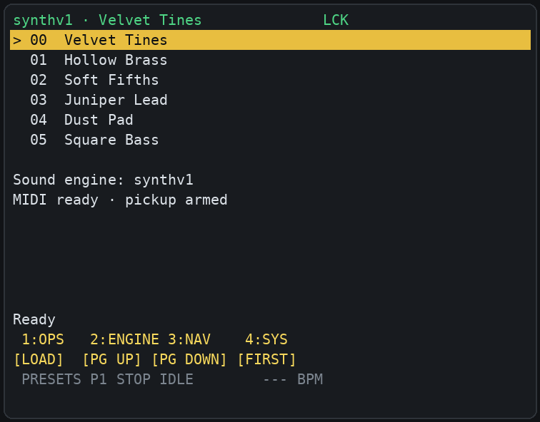
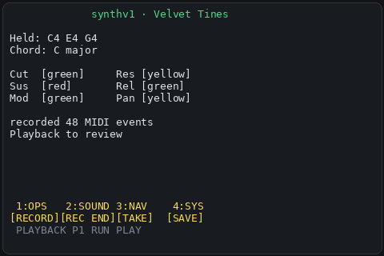
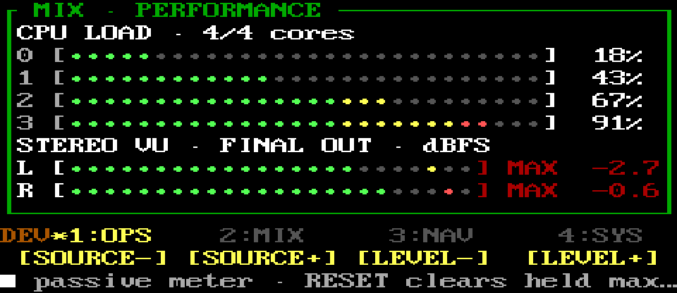
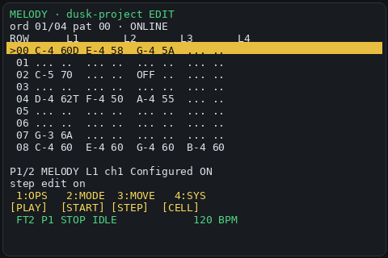
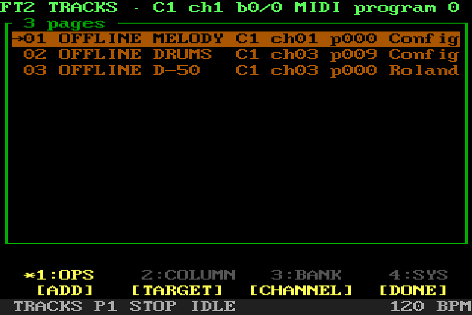
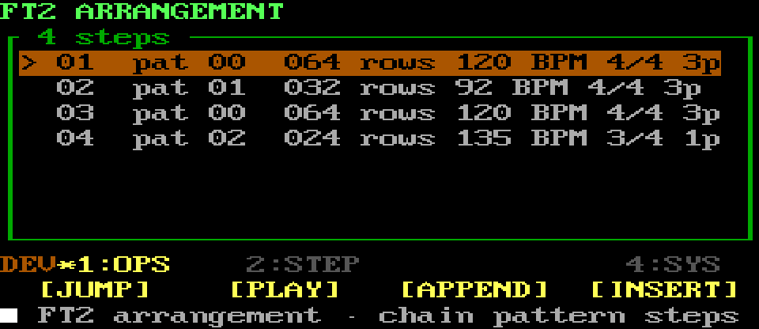
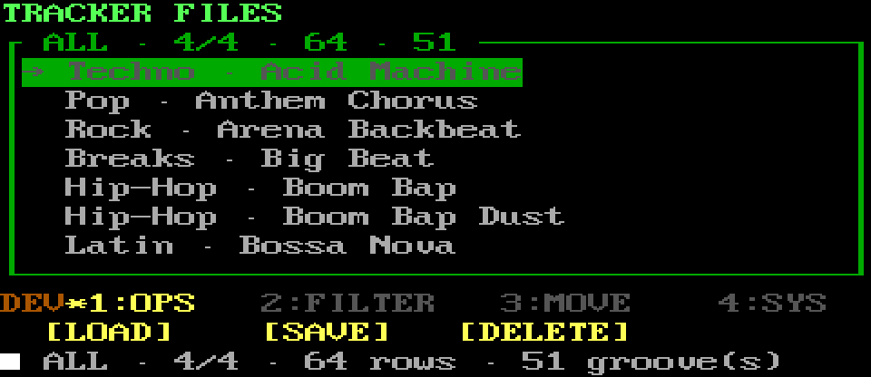
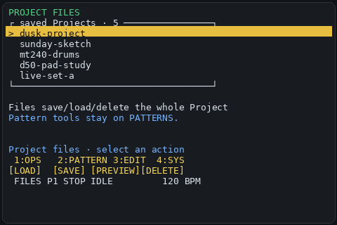
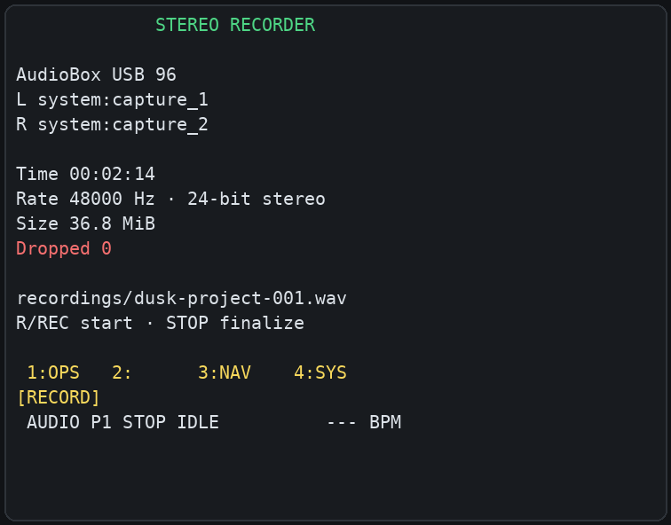

<p align="center">
  
</p>

> [!WARNING]
> **SHR-DAW is highly experimental.** Back up Projects and user data, expect
> breaking changes, and keep monitoring levels low while testing audio.

SHR-DAW turns a Raspberry Pi, a 40×20 terminal, and optional MIDI gear into a
focused music workstation. Play software or external instruments, build FT2
Patterns and Arrangements, use effects, import private loops, save MIDI ideas,
record synchronized raw multitrack audio, and capture the protected final
stereo performance mix from compatible JACK interfaces.

Start with a Pi and computer keyboard. Add a MIDI controller, synth, audio
interface, or dedicated screen when useful.

## Explore first, explain later

SHR-DAW is not only for experienced musicians. It is meant to be approachable
to curious children, first-time music makers, returning older learners, and
Raspberry Pi enthusiasts who want a reason to explore sound, MIDI, routing, or
small-computer music without beginning inside a full desktop studio.

That direction comes from the creator's personal belief, not a claim that
everyone learns in the same way: some people become interested in theory only
after play gives them a question worth answering. In Playback, the learner can
choose a root plus major or natural-minor N00B scale; keys outside it stay
silent, while allowed keys immediately produce sound. The 40×20 display names
the held notes and recognized chord, shows each strike velocity, and highlights
exactly which notes are sounding on the continuous keyboard. A learner
exploring C-sharp minor might build `C#m`, change an allowed note, see the chord
name change, and begin asking why `E maj` or `A maj` can feel related. Normal
mode restores every chromatic note. SHR gives the discovery an audible and
visible result that can make the learner curious about the explanation.

FT2 keeps the same N00B scale gate available as an independent switch while
the learner plays along, records in real time, or uses Step Edit. In Record and
Edit, allowed notes can be written into the Pattern while rejected notes remain
silent and unwritten. Step Edit separately accepts up to four played notes at
once and offers familiar 1/1–1/32 note lengths independently of the cursor
advance. Drums retain their dedicated unfiltered Step Edit workflow. The aim is
not to remove music theory: it is to let sound, movement, names, repetition,
and personal conclusions create a doorway into it.

## Quick start

On Patchbox OS, Raspberry Pi OS, or Debian:

```sh
./scripts/install.sh
shr-setup
shr doctor
shr
```

The browser and external-MIDI tracker work without JACK. Software-instrument
audio, WAV loops, effects, and live recording require a running JACK server;
SHR-DAW never starts or restarts it implicitly. Continue with
[First run](docs/FIRST_RUN.md).

During interactive setup, accept the recommended exclusive-routing cleanup.
It prevents distribution FluidSynth and automatic MIDI-patching services from
loading a background sound bank, doubling notes, or connecting unintended
devices. FluidSynth remains available and is started only when SHR loads one of
its sounds.

## At a glance

- Browse synthv1, Yoshimi, and FluidSynth sounds without layering managed
  engines.
- Route one controller to software or external MIDI instruments.
- Learn the master rotary first, then use it to browse optional controller
  mappings; each item keeps its first movement until the rotary moves on.
- Optionally drive a controller arpeggiator from SHR's dedicated 24-PPQN
  clock/transport output without reusing a musical tracker route.
- Sequence self-contained FT2 Patterns whose synth and MIDI routes audition
  directly from the selected page.
- Load and edit 72 bundled drum grooves.
- Open ten cleared public-domain demo Projects, with matching Standard MIDI
  files and five separable arrangement parts.
- Save free-timed MIDI Ideas and private tracker Projects.
- Start with four CC0 48 kHz WAV loops, optionally download private
  tempo-labelled drums during setup, and monitor the loop-only stereo meter.
- Sum the managed software instrument, owned WAV loop, and one exact configured
  stereo input through master effects, a linked lookahead limiter, final meter,
  playback, and a 24-bit stereo final-mix recorder.
- Use a computer keyboard, mouse, or small configured controller.

New Projects start with Pattern-owned Software Synth, MIDI channel 1/program 1,
and Drums channel 10 pages. An empty routed Pattern can explicitly replace that
private new-Pattern template when saved. The standalone Software Synth owns its loaded
sound only until that top-level workspace exits; FT2 loads the preset named by
its Pattern and never inherits the standalone choice. Missing preferred
MIDI/audio hardware remains visible and never rewrites a saved route.

Hardware names and routes remain configuration data. The owned effects graph
is opt-in and disabled by default. When enabled it requires exactly the managed
instrument, owned WAV loop, and configured stereo input. See the
[final performance bus](docs/FINAL_PERFORMANCE_BUS.md),
[How it works](docs/HOW_IT_WORKS.md), and the
[audio graph contract](docs/AUDIO_GRAPH.md) for the exact boundaries.

## Screens

SHR opens on a centered Home menu. Every row uses the same wide selection bar,
with its label centered, so focus never changes width while browsing. Turn the
master rotary or use Up/Down, then press the rotary or Enter to open Software
Synths, FT2, Recorder, Performance, MIDI Learn, Routing, Effects, Ideas, or
Help. Back from a top-level workspace returns Home; editors and child tools
return one level at a time.

MIDI Learn, Routing, and Effects are separate top-level destinations. Routing
is a read-only view of the current controller, external MIDI, clock, and audio
connections; `shr-setup` remains the single owner of hardware changes. If a
configured controller is offline, has no matching reviewed profile, or has an
incomplete learned master encoder, Home initially highlights MIDI Learn and
states why. A learned encoder with working turn and click remains usable even
when optional command buttons were skipped. Home never learns or transmits
anything merely by being opened.

The overview below shows the established performance workspaces. The
[visual menu manual](docs/MENU_MANUAL.md) retains the established workspace
renders; its current text and controller map describe this iteration because
the full screenshot set was deliberately not regenerated. The intentionally
plain Home and read-only Routing overview do not use dashboard screenshots.

Large sound and file lists support case-insensitive first-letter jumps when a
letter is not already a screen shortcut. Keyboard PageUp/PageDown remain
available where supported; command pads use screen-specific operations instead
of coarse list paging.

### Presets



Browse the three independent software-instrument catalogs.

### Playback



Play sounds, compare each held note's MIDI strike velocity, see the continuous
keyboard, shape mapped synthv1 controls, and record MIDI Ideas. Velocity helps
practise dynamics but is not an audio loudness measurement.

### Performance Meter



With the graph disabled, inspect CPU load and the legacy managed-source meter.
With the graph enabled, MTR becomes the compact three-source performance-bus
surface: source level/mute/readiness, master level, final meter, limiter gain
reduction, and final recording status.
[Meter details](docs/USING_SHR_DAW.md#performance-meters).

### FT2 Pattern Editor



Edit notes, velocity, programs, gates, commands, and multiple routed pages.
On a drum page, Step Edit keeps recurring drum voices in their earlier columns
instead of repacking every played combination from left to right. N00B is an
independent major/natural-minor input gate that remains active across FT2 Play,
Record, and Step Edit on melodic pages; note length belongs only to Step Edit.

### Pattern Pages



Choose one destination per page and an instrument setup for each column.

### FT2 Arrangement



Chain Pattern IDs into the Project timeline.

### Drum Pattern Library



Filter, load, edit, and save reusable four-lane rhythms.

### Project Files



Name, save, preview, and safely clean up Projects and Patterns.

### FT2 WAV Loop


Import private loops, align tempo and beat region, and monitor that WAV alone
on the separate `LOOP OUT` meter.

### Synchronized Multitrack Recorder



Name, map, and arm exact JACK inputs, then capture one shared timeline as
separate 24-bit mono stems plus a versioned session manifest. Missing preferred
hardware remains missing instead of silently falling back. See [multitrack
recording](docs/MULTITRACK_RECORDING.md) and the concrete [MR18 acceptance
plan](docs/MR18_TEST_PLAN.md).

## Optional hardware


Every device beyond the Raspberry Pi and audio output is optional. See
[Physical connections](docs/CONNECTIONS.md) for safe MIDI and audio paths.

## Documentation

- [First run](docs/FIRST_RUN.md) — configure and start.
- [Using SHR-DAW](docs/USING_SHR_DAW.md) — normal musical workflow.
- [Complete screen and menu manual](docs/MENU_MANUAL.md) — every screen,
  editor context, and controller-menu page with populated screenshots.
- [Tracker guide](docs/TRACKER.md) — Patterns, pages, Arrangement, drums, and
  loops.
- [Installation](docs/INSTALLATION.md) — dependencies, local evaluation,
  upgrades, and removal.
- [Development story](docs/BUILD_WEEK.md) — how SHR-DAW was built on the Pi
  with Codex, what each side contributed, and the Build Week record.
- [Complete documentation index](docs/README.md) — configuration, controller,
  architecture, measurements, audits, and future plans.

## Development

SHR-DAW is a personal weekend project developed and validated directly on its
Raspberry Pi. The detailed target-native, high-autonomy Codex workflow and its
human/AI decision boundary belong in the [development story](docs/BUILD_WEEK.md),
not in this product overview.

## License

SHR-DAW code, the 21 included presets, original demo arrangements, and bundled
rhythm data are MIT licensed; the four bundled WAV loops are CC0. The demo
compositions themselves are documented public-domain sources. Read
[THIRD_PARTY.md](THIRD_PARTY.md) before packaging the project or adding sounds.

---

<p align="center">
While I was releasing the first version of this software, my uncle died. So I dedicate this project to him.<br>
Počivao u miru, striče Mile, puno te volim!
</p>
