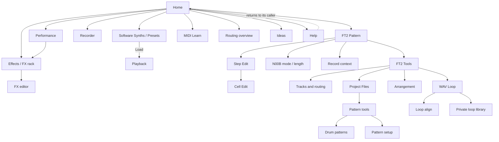

# Screen and menu manual

This is the visual guide to SHR-DAW's established 40×20 workspace and editor
screens. The new intentionally plain centered Home list and read-only Routing
overview are documented textually during competition fast iteration; the full
screenshot set was not regenerated for that navigation-only change. The
current controller map is authoritative in
[Controller interface](CONTROLLER_INTERFACE.md). Existing screenshots are drawn by the real Rust UI from
deterministic, populated presentation states; they do not start JACK, open a
MIDI port, or claim to show a live audio measurement.

The manual is split into three chapters so it remains usable on a phone:

1. [Everyday screens](menu/EVERYDAY_SCREENS.md) — Presets, Playback, Ideas,
   Help, synchronized multitrack recording, and the performance meter.
2. [FT2, Projects, and Patterns](menu/TRACKER_AND_PROJECTS.md) — the tracker in
   Play, Record, Step Edit, and Cell Edit; Tools; N00B length entry; Projects;
   Pattern tools; drum patterns; Arrangement; the Tracks screen; and routing
   fields.
3. [Loops and effects](menu/LOOPS_AND_EFFECTS.md) — WAV loop setup, loop-file
   management, alignment, the effects rack, and the parameter editor.

## How to read a screen

Each screenshot is a 40-column by 20-row terminal image. It is first rendered
as a native 480×320 bitmap using the project VGA console font, then enlarged to
960×640 by copying every pixel into an exact 2×2 square. There is no font
substitution, smoothing, interpolation, or antialiasing.

The bottom controller strip has four page positions and four action positions:

- On an eight-button controller, the first four buttons choose the page and
  the second four run the shown actions.
- On a five-button controller, one button cycles pages and four run actions.
- On a four-button controller, press the main encoder to enter page selection,
  turn it to choose a page, press it again, then use the four buttons.
- Empty pages and actions are hidden and skipped.
- Page 1 holds the screen's primary workflow; on FT2 it is Page−/Page+/Track−/
  Track+. On workspaces, child screens, and editors, `SYS` item 4 is `EXIT`,
  which goes back one level. MIDI controls never quit SHR-DAW.
- `PANIC` stops owned playback and sends All Notes Off. It does not kill an
  unrelated synth or JACK client.

The yellow page name at the bottom is the page currently selected. The yellow
bracketed numbers below the actions are the physical item positions. Status
text and colors above the strip belong to the active screen.

## Screen flow

The Help screen returns to whichever screen opened it. `EXIT` follows the
arrows in reverse by one level. Top-level workspaces return Home; nested tools
return to their parent first.

## Naming and safety conventions

- **Project** means the whole saved tracker song: Patterns, Arrangement,
  routes, programs, loop settings, and effects.
- **Pattern** means one reusable block of rows inside a Project.
- **Page** means four tracker lanes that share a MIDI destination. Each lane
  can still have its own channel, bank, and program.
- **Idea** means a free-time MIDI take associated with a sound; it is not an
  audio recording.
- **Audio recording** means one synchronized take containing a 24-bit mono WAV
  for each armed JACK source plus a versioned session manifest. A legacy stereo
  input remains a linked two-track configuration.
- **Remove Loop** detaches the WAV from the Project. Deleting a private WAV is
  a separate confirmed action and is refused while saved Projects reference it.
- With the graph active, FX edits require stopped transport and no active
  recording. With it disabled, FX edits change saved Project data only.

For the source-of-truth page/action matrix and controller reachability rules,
see the [controller interface](CONTROLLER_INTERFACE.md). For computer keyboard
commands and deeper musical workflows, continue with [Using SHR-DAW](USING_SHR_DAW.md)
and the [tracker guide](TRACKER.md).
