# Everyday screens

[Manual home](../MENU_MANUAL.md) · [FT2 and Projects](TRACKER_AND_PROJECTS.md) ·
[Loops and effects](LOOPS_AND_EFFECTS.md)

All values shown below are deterministic presentation data. The screens are
real SHR-DAW renders, but no instrument, MIDI take, recorder, or meter was live
while the images were made.

## Home

Home is the navigation root. Its nine labels are centered inside equal 36-cell
bars spanning zero-based columns 2–37 on the 40-column display. The block is
centered vertically and scrolls safely on compact supported terminals.

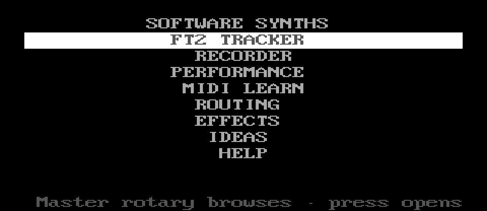

The master rotary browses the current screen content and its press opens or
confirms the selection. On the configured MiniLab, pads do not navigate this
plain list: the first four select controller-menu pages and the other four
invoke that page's items wherever a controller strip is present.

## Presets

**Software Synths** opens Presets. Turn the main encoder, use the arrow keys,
or use the mouse wheel to choose a sound. Loading replaces the one managed software
instrument; it never layers engines. synthv1, Yoshimi, and FluidSynth remain
separate catalogs selected with the Engine page.

Home keeps **MIDI Learn**, **Routing**, and **Effects** separate. Routing is the
rotary browse/edit/confirm/cancel editor; Effects is the existing Project rack.
Routing selections wrap, and merely browsing never writes configuration or
opens/transmits through a MIDI output. Its live state names the discoverable
interface separately from the configured downstream profile: an AudioBox may
be `ONLINE` while a D-50 remains `UNVERIFIED`, because DIN supplies no device-
presence feedback. If a
configured controller is offline, unreviewed, or has an incomplete learned
encoder, MIDI Learn is selected first and Home explains why. Keyboard arrows
and Enter remain available. A learned turn-and-click encoder is sufficient;
optional command buttons may remain unmapped.

Presets and Playback share one Software Synth sound, and leaving them keeps it
running for effects and other screens. Global panic, shutdown, replacement, or
an explicit different FT2 software route stops only that SHR-owned engine. A
genuinely new, empty, unsaved default FT2 Project adopts the current selection
on page 1 without restarting it; with no Player instrument, FT2 loads the first
available synthv1 preset. Saved or explicitly changed Projects keep their own
routes.

### OPS — browse and load

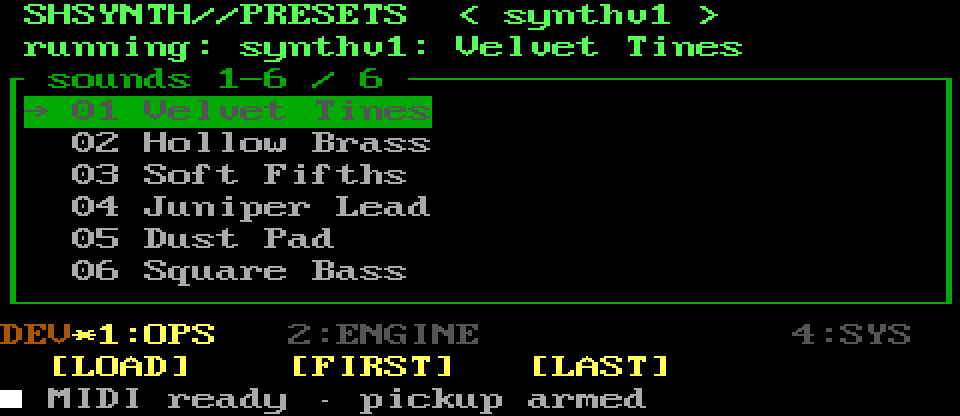

`LOAD` starts the highlighted sound. `FIRST` and `LAST` jump to the ends of the
current engine's catalog. Keyboard PageUp/PageDown still move by ten sounds;
physical command pads deliberately do not duplicate that coarse scrolling.

### ENGINE — change instrument host

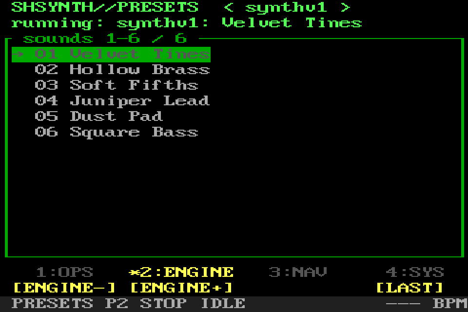

`ENGINE-` and `ENGINE+` move among synthv1, Yoshimi, and FluidSynth. Changing catalogs does not
load a sound until `LOAD` is used.

### SYS — safety and help

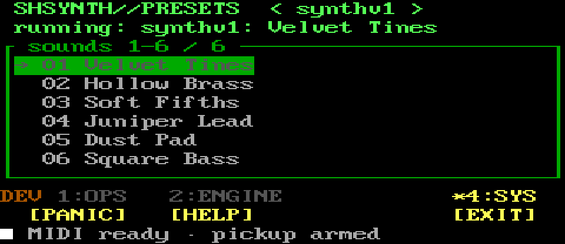

`PANIC` stops owned playback and notes. `HELP` opens the local help reader.
`EXIT` returns to Home. MIDI never quits the application; quitting remains
computer-keyboard-only from Home.

## Playback

Playback appears after a sound is loaded. At native 40×13 the body shows the
held chord and notes, each note's decimal MIDI strike velocity directly beneath
it, and the 12 mapped synthv1 controls. Taller terminals use spare space for a
continuous two-row keyboard state. The
aligned velocity row helps with gentle/strong control, consistent chord
attacks, and bass-plus-chord balance. It is MIDI input data, not an audio
loudness meter; controller and instrument response determine the audible
result.
On the keyboard, red white-key areas are held natural notes and red upper `└`
marks are held sharps. Parameter colors are relative to the loaded preset:
green below the original value, bright yellow near it, and red above it. The
main encoder press resets only these mapped controls and re-arms pickup; it does
not restart the synth.

### PLAY — capture a MIDI take

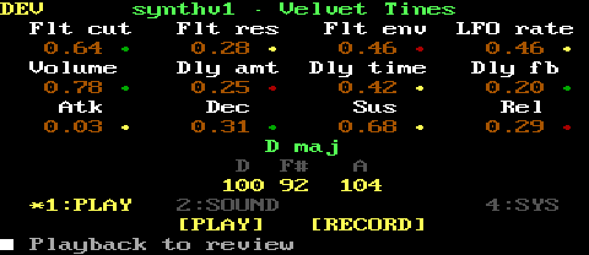

`PLAY` plays or stops the captured take. `RECORD` starts or stops free-time MIDI
capture.

### SOUND — reset, save, and scale filter

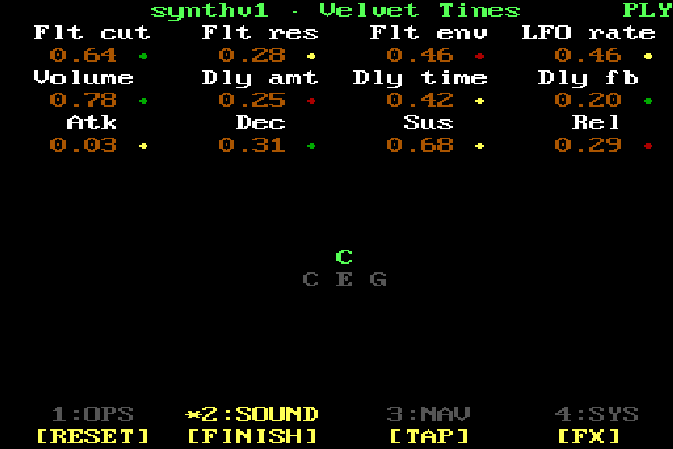

`RESET` restores the 12 mapped parameters in place and re-arms hardware pickup.
`SAVE` publishes a new non-overwriting Idea. `N00B` toggles the optional scale
filter without leaving Playback or hiding any normal content. While it is on, a
single compact `SCALE` rotary appears below the 12 controls; turning the master
encoder cycles every chromatic root in major and natural minor. Pressing N00B
again removes only that control and restores chromatic play.

### SYS — safety, effects, help, and return

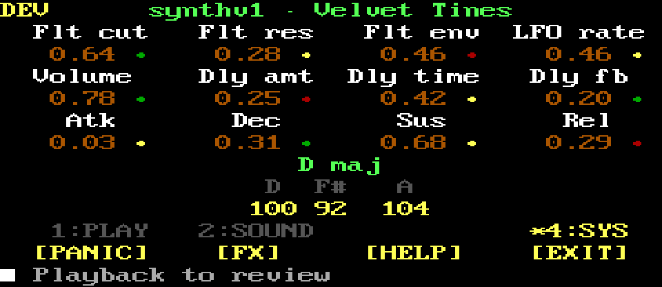

`PANIC` performs the global owned stop. `FX` opens the current Project rack
without restarting the sound. `HELP` opens help and returns here afterward.
`EXIT` returns to Presets, then Presets `EXIT` returns Home.

### N00B-on Playback pages

N00B changes only the scale filter and its compact rotary; the three Playback
controller pages keep the same actions and ordering.

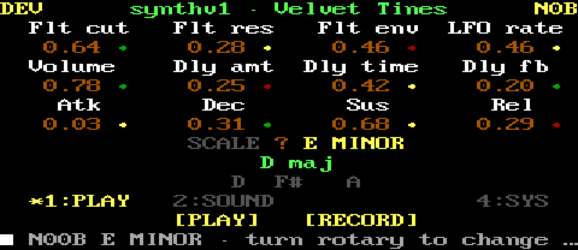

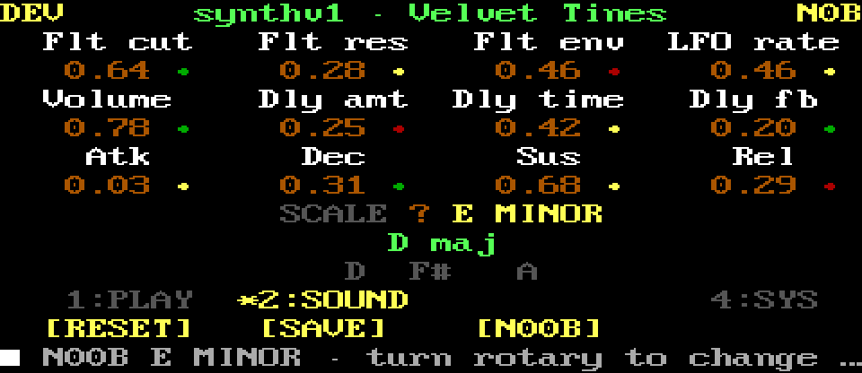

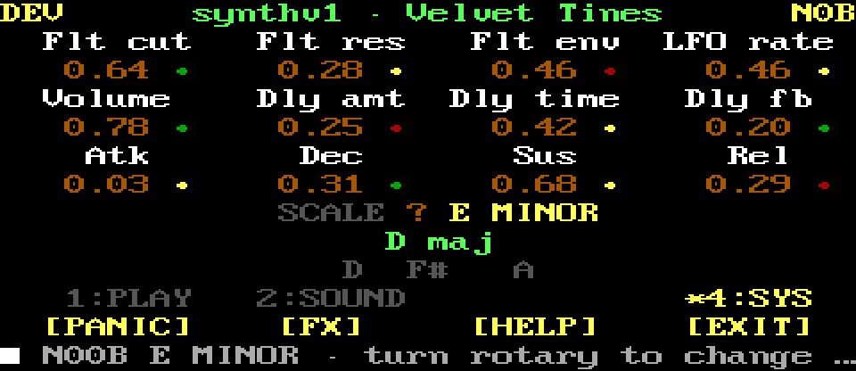

## Ideas

Ideas are timestamped or numbered free-time MIDI takes. A synthv1 Idea carries
a private preset snapshot; external-engine Ideas retain their sound identity
instead. Turn the encoder to select an entry.

### PLAY — inspect, play, record, or delete

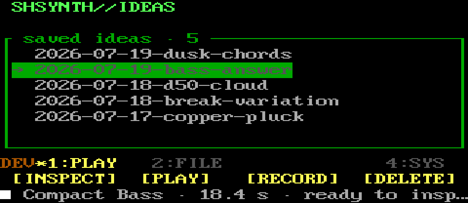

`INSPECT` shows the Idea's sound and recording metadata. `PLAY` plays or stops
the take. `RECORD` starts or stops capture. `DELETE` requires a repeated
confirmation and only removes the selected Idea.

### FILE — load or save an Idea

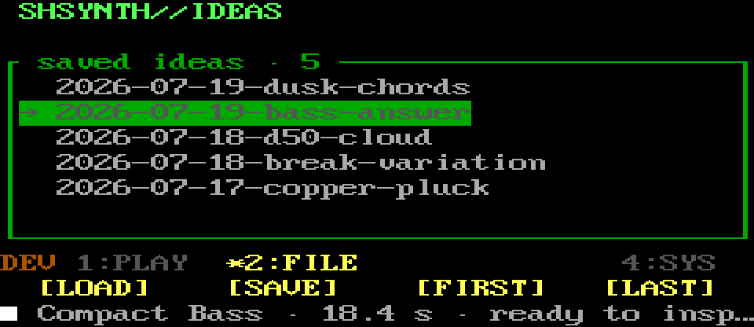

`LOAD` restores the selected Idea, asking for confirmation before replacing an
active sound. `SAVE` publishes a new non-overwriting Idea. `FIRST` and `LAST`
select the list boundaries.

### SYS — safety, help, and return

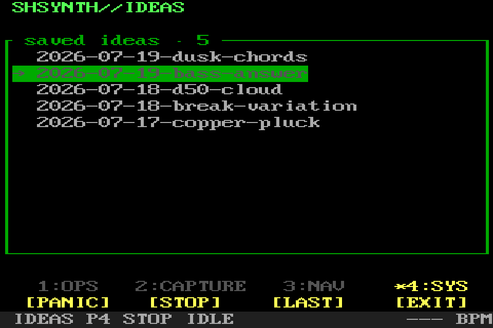

`PANIC` stops owned notes and transports. `HELP` opens contextual help. `EXIT`
returns Home.

## MIDI Learn

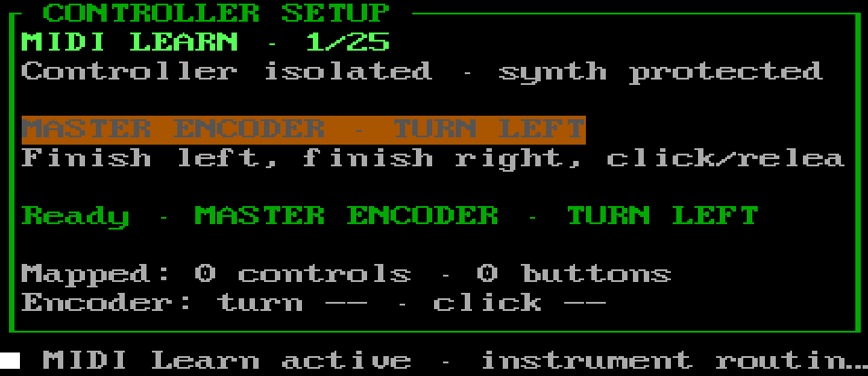

MIDI Learn isolates controller messages from instruments while it captures the
master rotary's counter-clockwise turn, clockwise turn, and click, followed by
optional absolute controls and command buttons. Release each opening control
as prompted. The review step writes a private controller profile only after
confirmation; Back cancels without saving. A learned master rotary is enough
to browse and confirm even when optional buttons are skipped.

## Help

Help is always available locally with `?` or F1, even if the optional temporary
LAN page cannot bind. Turn the encoder one rendered row at a time. On eight- or
five-button layouts, encoder press follows a selected section link.

### OPS — read and follow links

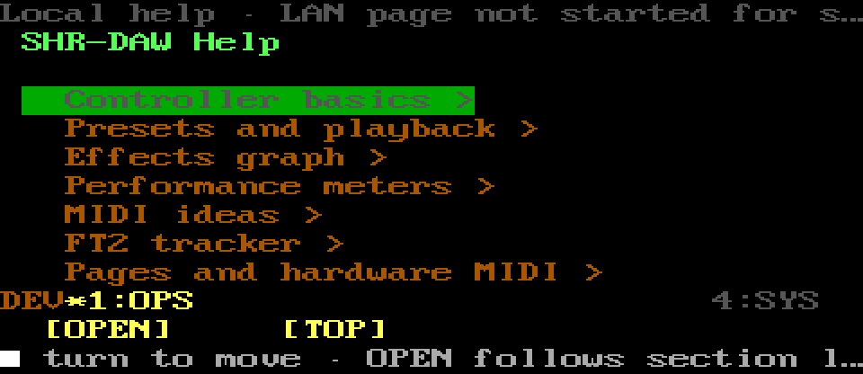

`OPEN` follows the highlighted internal link and is the required link action on
a four-button layout. `TOP` returns to the beginning. Keyboard
PageUp/PageDown retain page scrolling; physical pads do not.

### SYS — safety and return

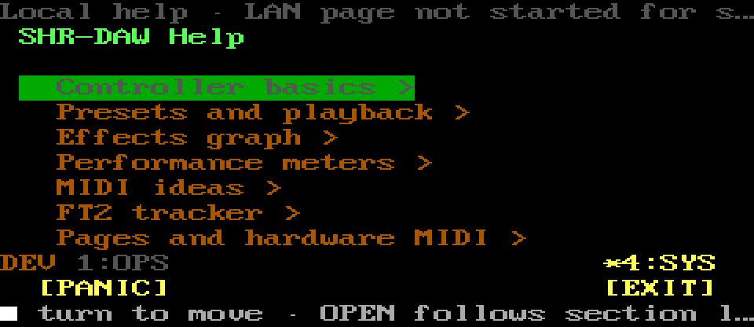

`PANIC` remains available while reading. `EXIT` returns to the exact screen
that opened Help.

## Audio recorder

The recorder captures any deliberately configured set of JACK source ports as
one synchronized take with a 24-bit mono WAV per input and a shared manifest.
The compact list shows named tracks as ready or missing. Its body shows armed
count, elapsed time, sample rate, writer high-water mark, drop/xrun counts,
final path, or the failure reason; the one shared final status row remains
separate below the two controller rows. It never starts or restarts JACK.

### RECORD — arm and record

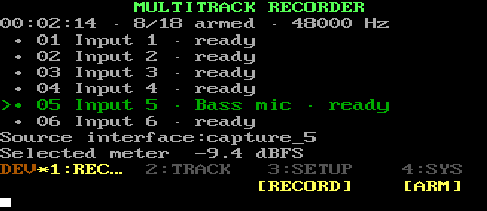

`RECORD` starts all armed tracks at one callback boundary. `ARM` toggles the
selected track. An armed missing source prevents a take from starting.

### TRACK — choose the inputs

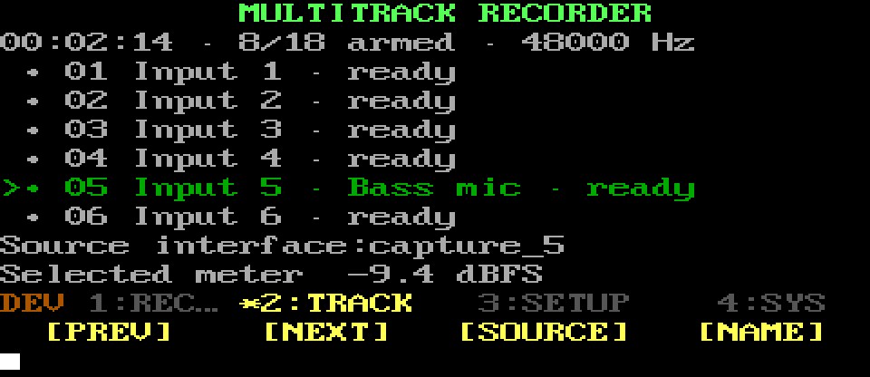

`PREV` and `NEXT` select a track. `SOURCE` cycles deliberately through the
currently discovered sources (and blank); `NAME` edits the musician-facing
label. Runtime absence never overwrites a remembered source.

### SETUP — prepare tracks

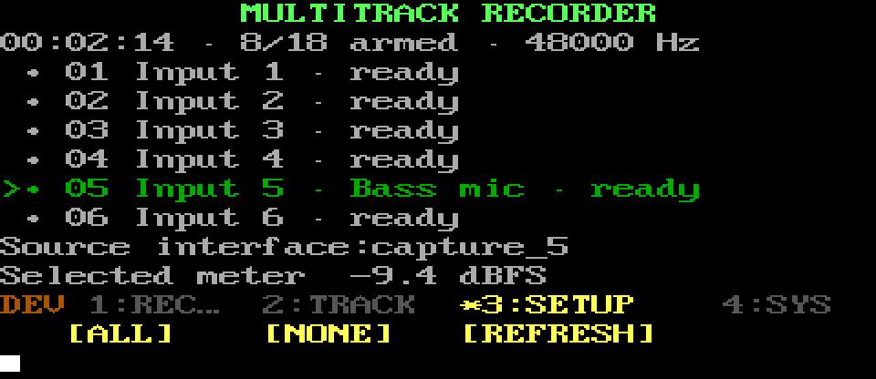

`ALL` arms every resolved track, `NONE` disarms everything, and `REFRESH`
discovers current JACK audio sources without changing assignments.

### SYS — finalize safely

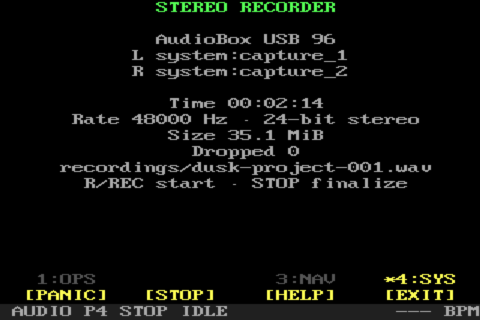

`PANIC` stops owned activity. `HELP` opens help. `EXIT` returns Home without
silently changing recorder state.

## Performance meter

With the final bus enabled, MTR selects the managed Synth, Loop, or exact Input
source, controls its bounded level/mute, shows readiness and the post-limiter
final meter, and controls final stereo recording. With the graph disabled it
keeps the CPU/legacy meter presentation without pretending that direct output
is being measured. CPU is whole-core `/proc/stat` activity, not callback timing
or xruns.

Every horizontal meter cell is a circular `●` LED. Unlit cells are dark gray;
safe active cells use one green; yellow and red appear only at their active
thresholds; a held peak is a brighter circle in the applicable threshold
colour. No square bar or line-marker glyph represents level or peak.

### OPS — source and level

`SOURCE-`/`SOURCE+` choose Synth, Loop, or Input. `LEVEL-`/`LEVEL+` change only
that source's bounded final-bus level.

### MIX — mute, record, and holds

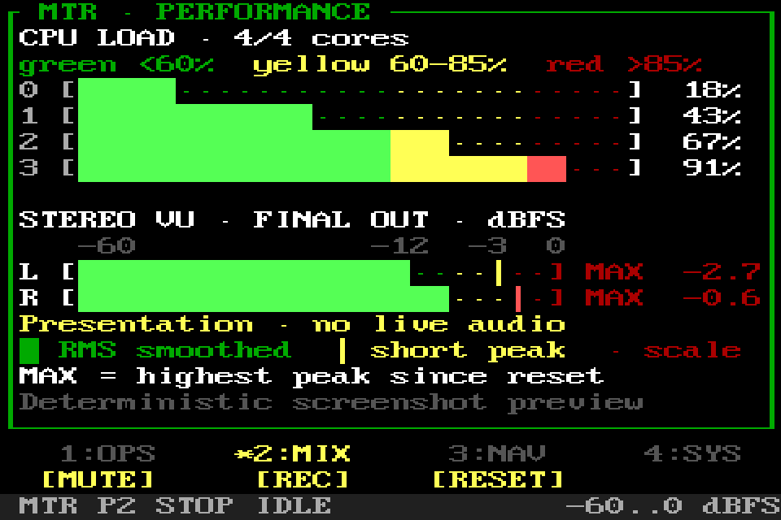

`MUTE` changes the selected source. `RECORD` toggles the callback-boundary final
stereo recorder. `RESET` clears presentation peak/clip holds; it does not reset
effects, CPU state, or transport.

### NAV — FX master overlay

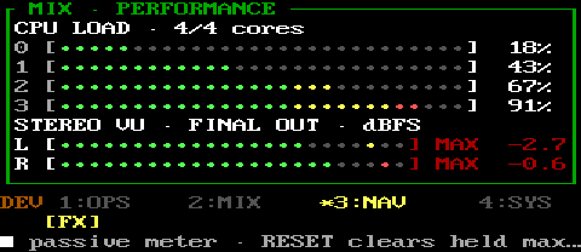

`FX` opens the same master-overlay layer used by FT2. Choose SOURCE, AUX 1,
AUX 2, or MASTER, then click/Enter to open that rack.

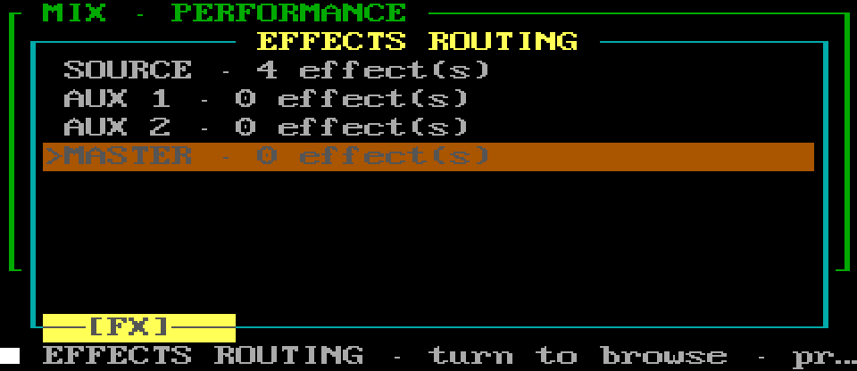

The MTR remains underneath; pressing the highlighted `FX` again closes the
overlay without changing audio or Project state.

### SYS — safety and return

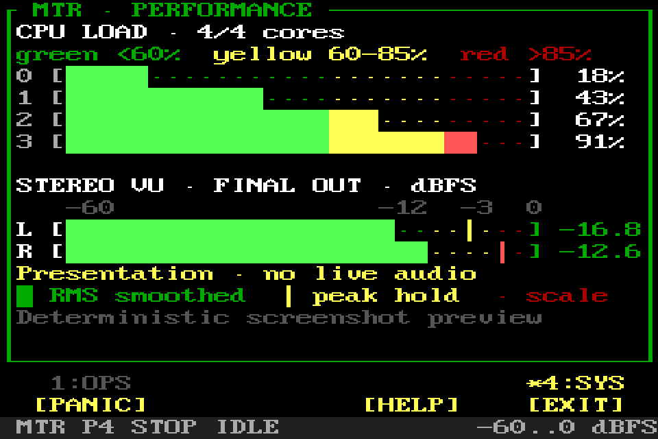

`PANIC` remains available. `HELP` opens the explanation of meter scope. `EXIT`
returns to Home. The screenshot says `Presentation · no live audio` because
its meter values are seeded for documentation rather than measured.

## Routing

Routing is a transactional editor for controller and performance inputs,
controller role, external MIDI/profile, controller clock, and the stereo audio
destination. Turn to browse rows and press to start an isolated draft. Turn to
change that field, then press to validate, save, and activate it; Back cancels
the draft without writing. Audio and clock changes that cannot be activated
live are clearly marked for the next managed-engine start.

### EDIT — browse or change one route

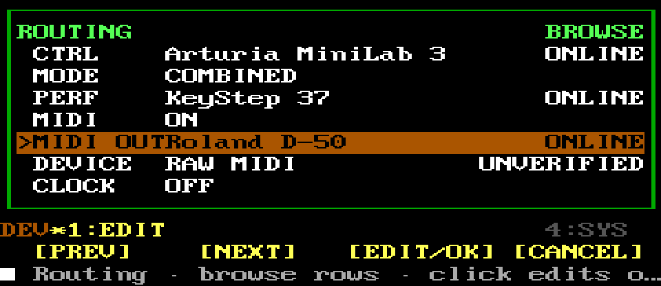

`PREV` and `NEXT` browse the same wrapping row list as the master rotary.
`EDIT/OK` starts or confirms the selected field. `CANCEL` abandons the active
field, or returns Home when no draft is active.

### SYS — safety and return

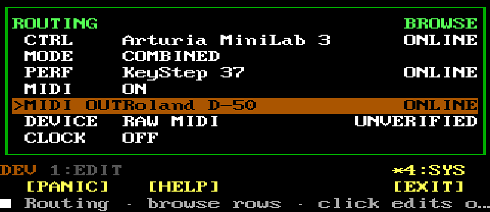

`PANIC` stops owned playback and sends All Notes Off. `HELP` opens the local
reference. `EXIT` cancels an active draft first, otherwise returning Home.
