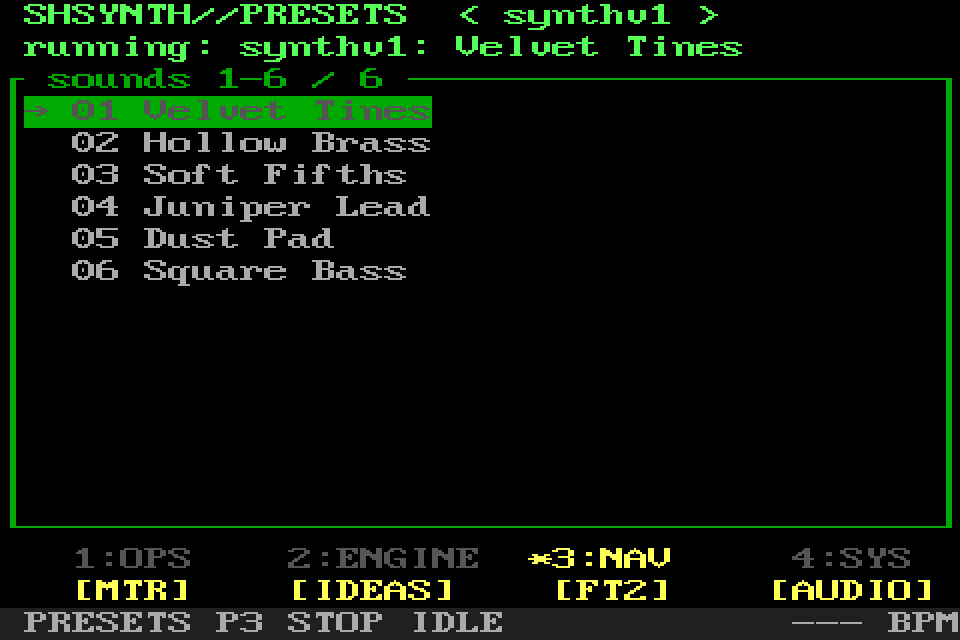
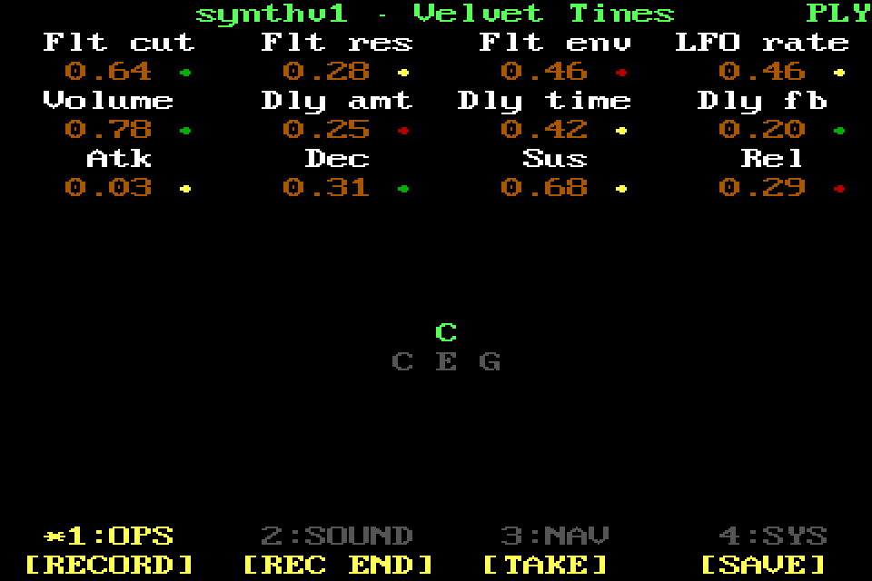
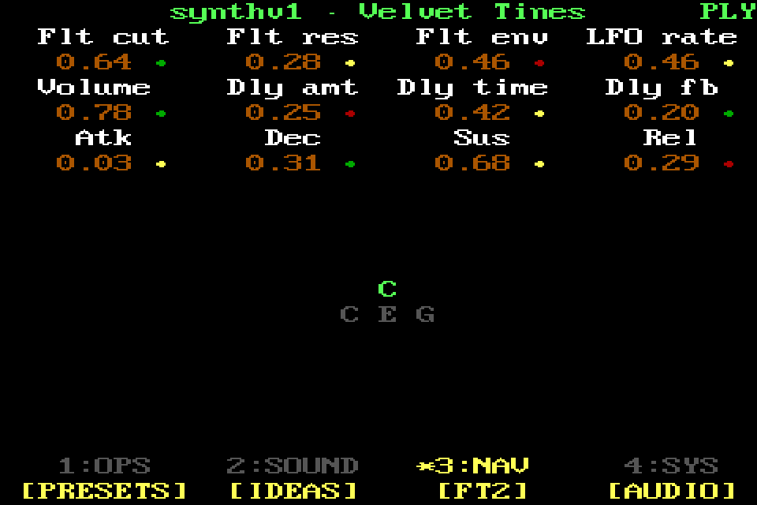
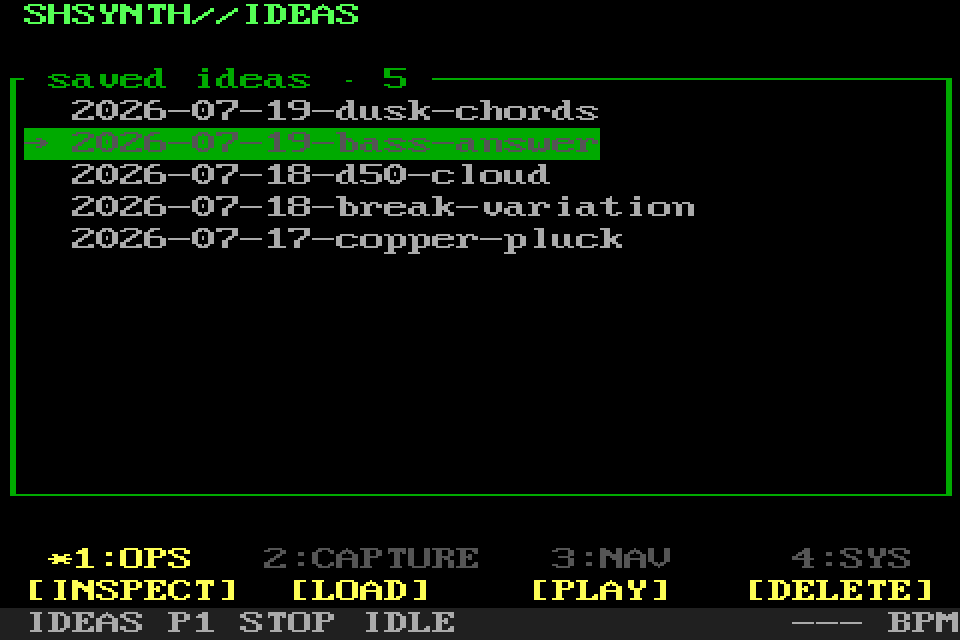
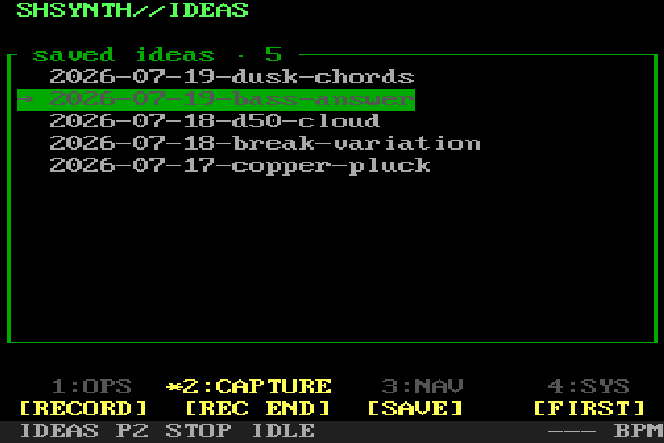
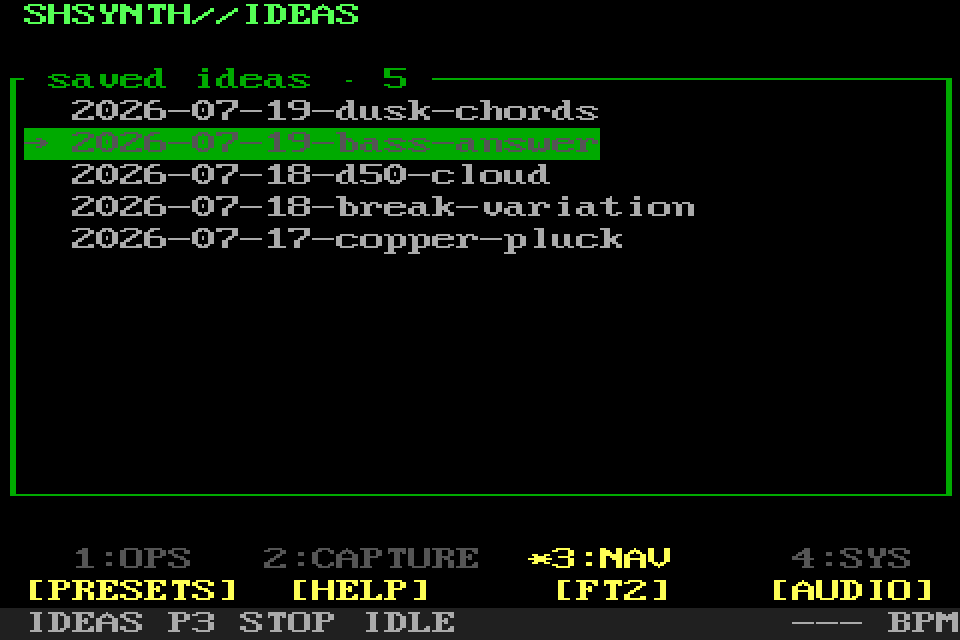
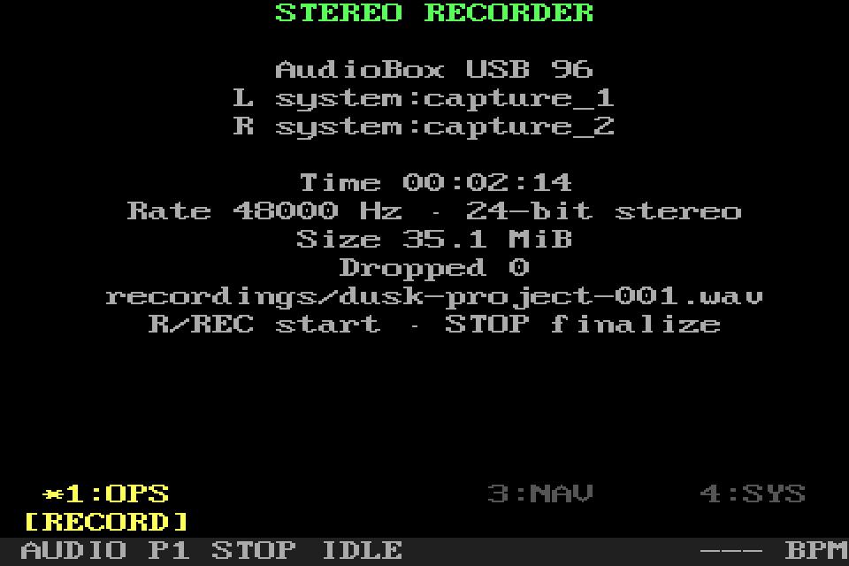
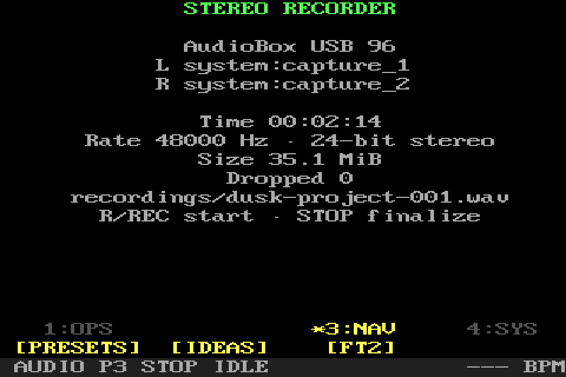

# Everyday screens

[Manual home](../MENU_MANUAL.md) · [FT2 and Projects](TRACKER_AND_PROJECTS.md) ·
[Loops and effects](LOOPS_AND_EFFECTS.md)

All values shown below are deterministic presentation data. The screens are
real SHR-DAW renders, but no instrument, MIDI take, recorder, or meter was live
while the images were made.

## Presets

Presets is the root screen. Turn the main encoder, use the arrow keys, or use
the mouse wheel to choose a sound. Loading replaces the one managed software
instrument; it never layers engines. synthv1, Yoshimi, and FluidSynth remain
separate catalogs selected with the Engine page.

### OPS — browse and load

`LOAD` starts the highlighted sound. `PG UP` and `PG DOWN` move by a visible
list page. `FIRST` jumps to the beginning of the current engine's catalog.

### ENGINE — change instrument host

`ENGINE-` and `ENGINE+` move among synthv1, Yoshimi, and FluidSynth. `LAST`
jumps to the final sound in the selected catalog. Changing catalogs does not
load a sound until `LOAD` is used.

### NAV — open another workspace

`MTR` opens the passive performance meter. `IDEAS` opens saved free-time MIDI
takes. `FT2` opens the Pattern editor. `AUDIO` opens stereo WAV recording.

### SYS — safety and help

`PANIC` stops owned playback and notes. `HELP` opens the local help reader.
Presets has no MIDI `EXIT`: quitting the application is deliberately
computer-keyboard-only.

## Playback

Playback appears after a sound is loaded. The body shows the held chord and
notes, a continuous two-row keyboard state, and the 12 mapped synthv1 controls.
On the keyboard, red white-key areas are held natural notes and red upper `└`
marks are held sharps. Parameter colors are relative to the loaded preset:
green below the original value, bright yellow near it, and red above it. The
main encoder press resets only these mapped controls and re-arms pickup; it does
not restart the synth.

### OPS — capture a MIDI take

`RECORD` starts a free-time MIDI take. `REC END` stops capture but leaves the
take unsaved. `TAKE` plays or stops the captured take. `SAVE` stores it as a
new Idea without replacing an existing one.

### SOUND — reset, finish, tempo, and effects

`RESET` restores the 12 mapped parameters in place and re-arms hardware pickup.
`FINISH` ends the current capture and saves it in one action. `TAP` estimates
tempo from repeated presses. `FX` opens the effects rack for this Project state.

### NAV — leave Playback

`PRESETS`, `IDEAS`, `FT2`, and `AUDIO` open their named screens. Navigation
does not implicitly save a pending MIDI take.

### SYS — stop and return

`PANIC` performs the global owned stop. `STOP` stops take playback. `HELP`
opens help and returns here afterward. `EXIT` returns to Presets.

## Ideas

Ideas are timestamped or numbered free-time MIDI takes. A synthv1 Idea carries
a private preset snapshot; external-engine Ideas retain their sound identity
instead. Turn the encoder to select an entry.

### OPS — inspect, load, play, or delete

`INSPECT` shows the Idea's sound and recording metadata. `LOAD` restores it,
asking for confirmation before replacing an active sound. `PLAY` plays or
stops the take. `DELETE` requires a repeated confirmation and only removes the
selected Idea.

### CAPTURE — make another Idea

`RECORD` starts MIDI capture with the current sound. `REC END` stops it.
`SAVE` publishes a new non-overwriting Idea. `FIRST` selects the oldest/top
entry.

### NAV — move to another workspace

`PRESETS`, `HELP`, `FT2`, and `AUDIO` open their named screens.

### SYS — safety and list boundary

`PANIC` stops owned notes and transports. `STOP` stops take playback. `LAST`
selects the newest/bottom entry. `EXIT` returns one level.

## Help

Help is always available locally with `?` or F1, even if the optional temporary
LAN page cannot bind. Turn the encoder one rendered row at a time. On eight- or
five-button layouts, encoder press follows a selected section link.

### OPS — read and follow links

`OPEN` follows the highlighted internal link and is the required link action on
a four-button layout. `PG UP` and `PG DOWN` scroll by a visible page. `TOP`
returns to the beginning.

### SYS — safety and return

`PANIC` remains available while reading. `EXIT` returns to the exact screen
that opened Help.

## Audio recorder

The recorder captures the configured JACK stereo input as a 24-bit WAV. The
screen reports the chosen input, elapsed time, sample rate, bytes written,
dropped frames, path, and any error. It never starts or restarts JACK.

### OPS — record or pause

`RECORD` starts capture and toggles the current recording state. Use the
dedicated stop/finalize action when the file should be closed cleanly.

### NAV — leave the recorder

`PRESETS`, `IDEAS`, and `FT2` open those workspaces. A recording should be
finalized before leaving.

### SYS — finalize safely

`PANIC` stops owned activity. `STOP` finalizes the WAV header and closes the
file. `HELP` opens help. `EXIT` returns one level.

## Performance meter

MTR is passive: it never changes the route. CPU bars come from bounded UI-side
system readings. Live stereo RMS bars, a short decaying peak marker, and the
independent non-decaying `MAX` numbers are shown only for the final output of
SHR-DAW's active owned graph. Direct mode and stopped engines are explicitly
reported as unavailable instead of displaying unrelated audio.

CPU is whole-core `/proc/stat` activity, not synth or graph process CPU, JACK
callback timing, or xruns. The audio bars are post-master for the managed
instrument and its two returns; they deliberately exclude the separate WAV
loop, recorder input, external hardware, and unrelated JACK clients.

### OPS — clear presentation holds

`RESET` clears both `MAX` numbers, the short peak markers, and the clip hold. It
does not reset audio, effects, CPU state, or transport. Moving the mapped
synthv1 Volume control downward clears both `MAX` numbers even before pickup
accepts the control; upward, equal, and unrelated control movements do not.

### SYS — safety and return

`PANIC` remains available. `HELP` opens the explanation of meter scope. `EXIT`
returns to Presets. The screenshot says `Presentation · no live audio` because
its meter values are seeded for documentation rather than measured.
