# Loops and effects

[Manual home](../MENU_MANUAL.md) · [Everyday screens](EVERYDAY_SCREENS.md) ·
[FT2 and Projects](TRACKER_AND_PROJECTS.md)

WAV loops and the owned effects graph require a running JACK server, but the
screenshots below are deterministic presentation states and never start JACK.
The loop player and graph operate only on resources owned by SHR-DAW.

## FT2 WAV Loop

A Project may attach one privately imported mono or stereo WAV. Import copies
the selected inbox file beneath the user's SHR-DAW data directory. The player
uses native pitch and requires the WAV sample rate to match JACK; it does not
time-stretch or pitch-shift audio to force a fit. The normal screen's stereo
`LOOP OUT` circular-LED bars show smoothed RMS, a brighter held peak,
independent session `MAX` values, and clip state for this WAV alone. They are deterministic preview
values in the screenshots below, not a live JACK measurement.

The meter tap is after the chosen region, interpolation, transport gate, and
edge fades, immediately before the loop player's existing two JACK outputs.
It does not include the synth, source/aux/master effects, recorder input,
hardware gain, or unrelated clients. With the owned graph active, the loop is
also one of the three sources summed exactly once into the Performance Meter's
post-limiter `FINAL OUT`; the raw loop meter remains loop-only.

The state line explicitly says `READY`, `NOT READY`, or `OUTPUT FAULT`. A white
position bar with a green playhead sits near the top whenever the attached WAV
has a valid decoded region. That bar remains visible when output activation
fails, separating successful decoding and region setup from the JACK fault.

### PLAY — import, remove, and transport

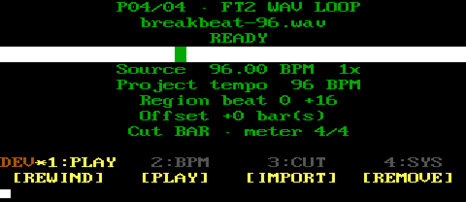

`REWIND` stops owned transport and returns to the Arrangement beginning.
`PLAY` starts or stops tracker and loop transport. `IMPORT` copies and loads
the selected inbox WAV. `REMOVE` requires confirmation, detaches the loop from
the Project, and unloads SHR-DAW's loop JACK client without deleting the WAV.

### BPM — interpret source tempo

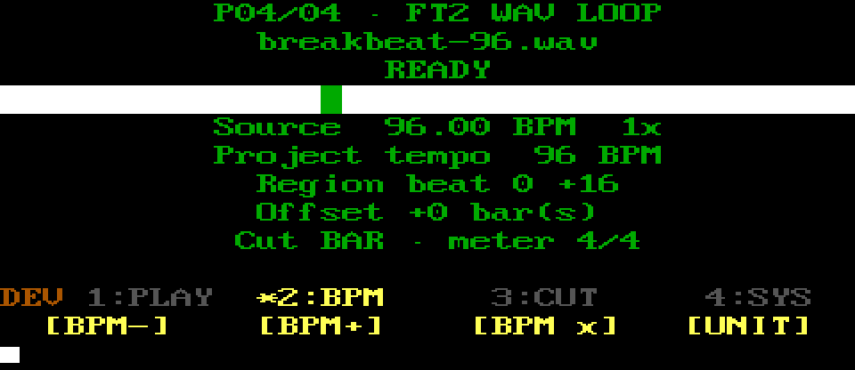

`BPM-` and `BPM+` change the interpreted source tempo. `BPM x` cycles half,
normal, and double interpretation. `UNIT` switches cut adjustment between
single beats and whole bars. Tempo matching changes the current Pattern tempo;
it does not alter the WAV samples.

### CUT — choose the beat region

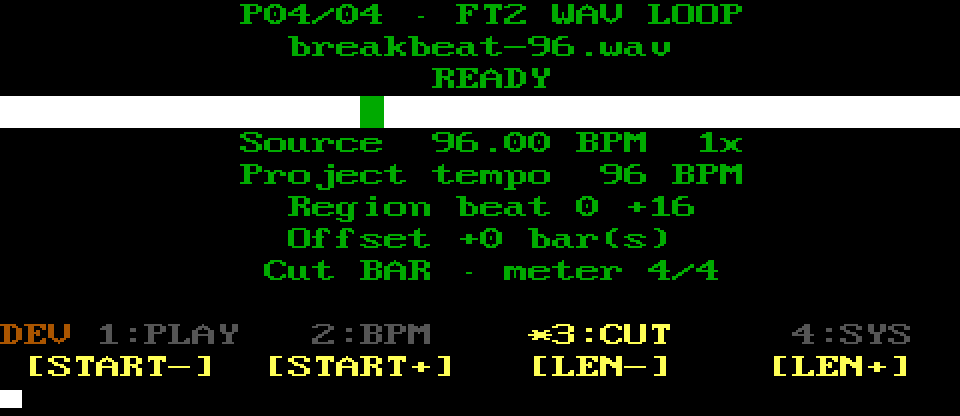

`START-` and `START+` move the region's first beat. `LEN-` and `LEN+` change
its length. The active `UNIT` determines whether each press means one beat or
one whole Project bar.

### SYS — safety, align, library, and return

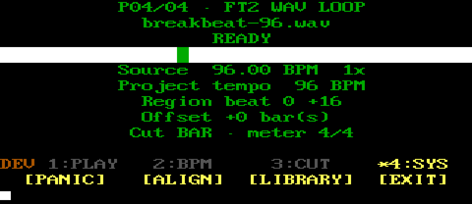

`PANIC` remains reachable. `ALIGN` opens offline analysis and placement
adjustment. `LIBRARY` opens the shared loop browser. `EXIT` returns to FT2
Tools.

## Private loop browser

`LIBRARY` opens the shared overlay over the unchanged loop page. It includes
`INBOX`, `CURRENT`, `PRIVATE`, and `SAVED` entries. Turn the rotary and press to
load a file; `INBOX` imports first, while the other types attach an existing
private WAV. Press highlighted `LIBRARY` again or Back to close without
changing the Project. The browser has no deletion action.

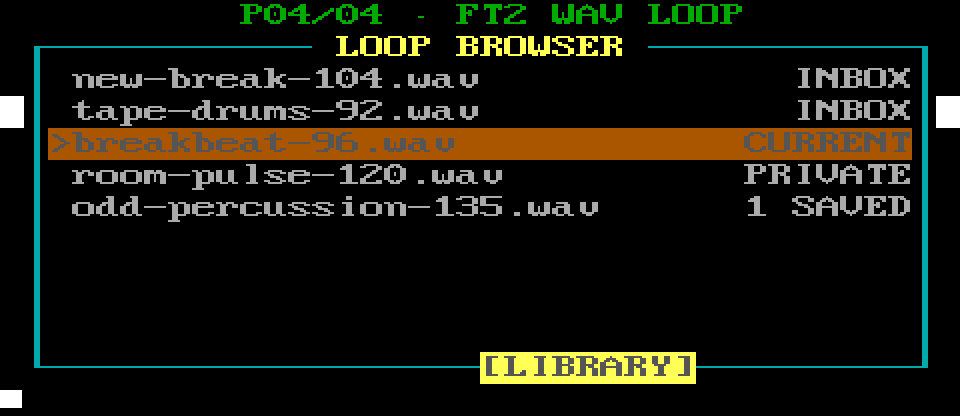

The caller remains visible while the overlay identifies each file's source and
Project relationship.

## Loop Align

Align performs bounded offline pulse/duration analysis, can snap interpreted
length to complete Project bars, and can shift placement without destructively
editing the audio file.

### OPS — analyze and place

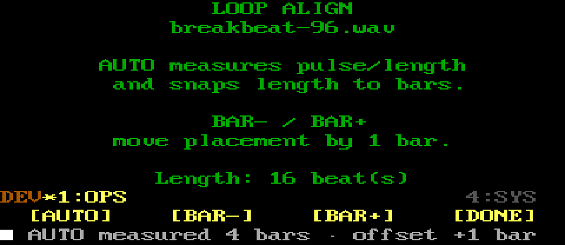

`AUTO` analyzes the attached file and proposes a bar-aligned beat length.
`BAR-` and `BAR+` move its placement by exactly one bar. `DONE` keeps the
settings and returns to WAV Loop.

### SYS — safety, help, and leave

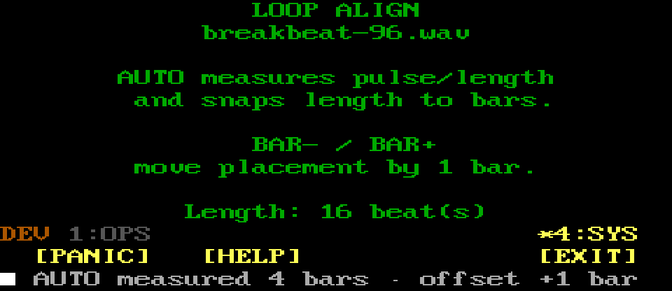

`PANIC` and `HELP` stay available. `EXIT` returns to WAV Loop without
performing another automatic analysis.

## FX Rack

The rack targets `SOURCE`, `AUX 1`, `AUX 2`, or `MASTER`. Source and master
racks are serial inserts. Aux buses have an independent send level, pre/post
source-insert point, wet-only processor rack, and return level. Each rack is
bounded to eight effects. With the graph active, FX changes are refused while
transport or recording makes publication unsafe. With it disabled, the same
controls edit saved Project data without touching audio.

The first screenshot shows a populated source chain. Selecting another target
keeps the same menu but changes the body and which routing actions apply.
The final blank-looking `+ INSERT EFFECT` row is a typed functional selection,
not an effect index or decoration. It remains reachable once, participates in
first/last wrapping, and click/Enter inserts an effect at that position.

### OPS — edit rack contents

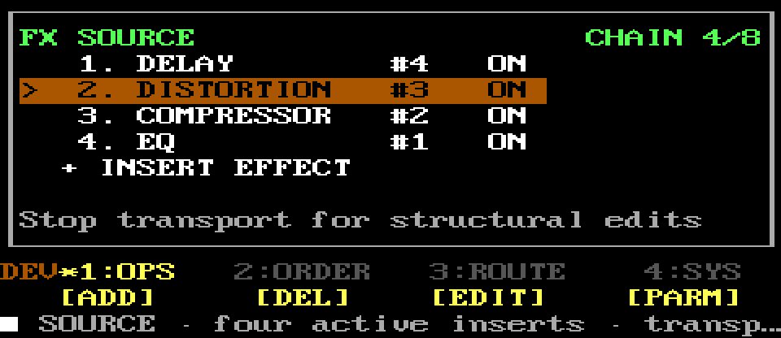

`ADD` inserts a provisional processor and opens its Type context. `DEL` removes
only the selected owned processor. `EDIT` opens the Type context for the
selected processor. `PARM` opens its named parameter editor.

### ORDER — reorder or bypass

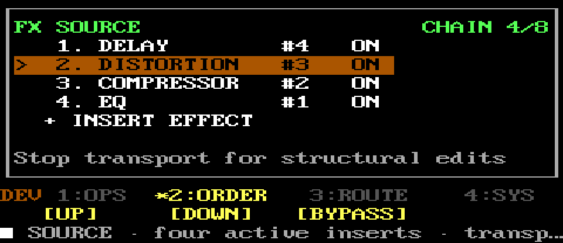

`UP` and `DOWN` move the selected effect within this rack. `BYPASS` fades it
between active and safe bypass. Aux targets offer only supported wet
time/modulation effects.

### ROUTE — choose rack and aux send

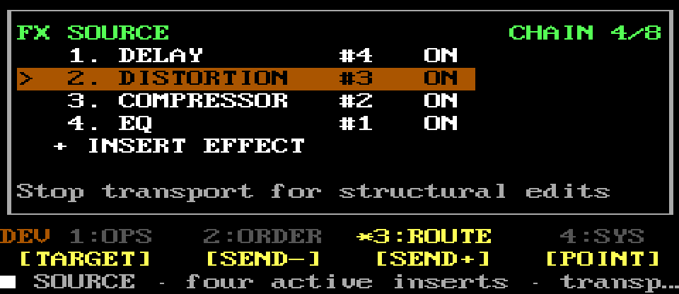

`TARGET` cycles Source, Aux 1, Aux 2, and Master. On an aux target, `SEND-` and
`SEND+` adjust its send level in dB and `POINT` toggles pre/post source inserts.
Those three controls report that an aux must be selected when used elsewhere.

### SYS — return level, help, and exit

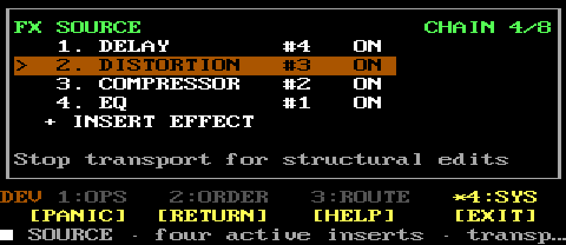

`PANIC` remains available. On an aux target, `RETURN` cycles its independent
return level. `HELP` opens the local reference. `EXIT` returns one level.

### Empty rack context

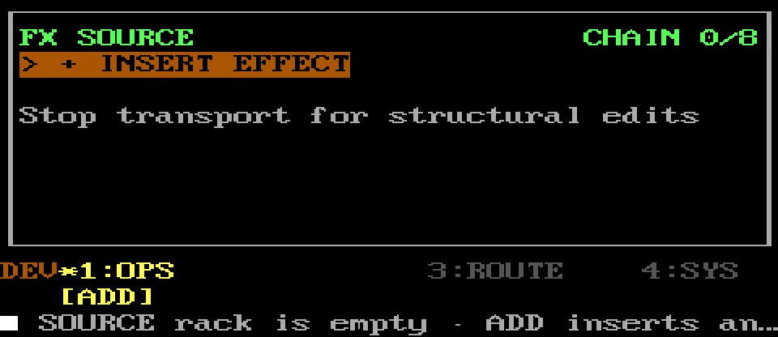

OPS exposes only `ADD`; unavailable edit and delete actions stay hidden.

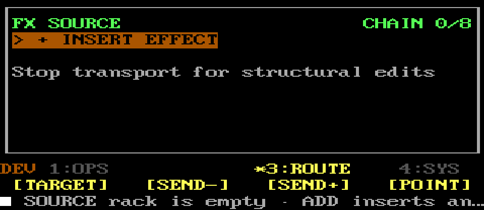

ROUTE still selects the target and, for an aux, its send settings.

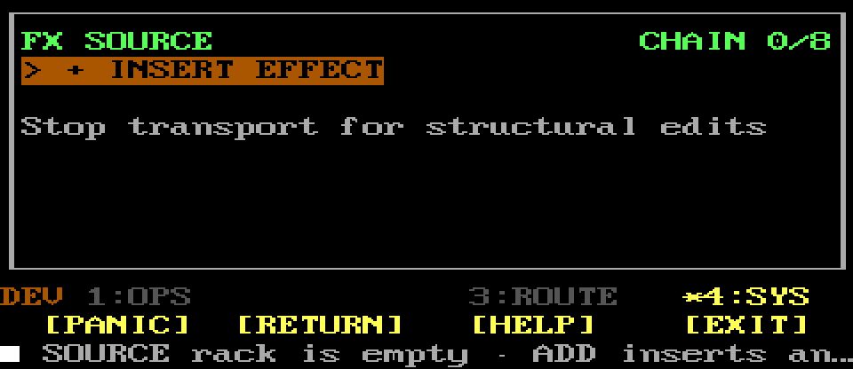

SYS preserves panic, return-level, help, and one-level exit actions.

### TYPE — choose or replace an effect type

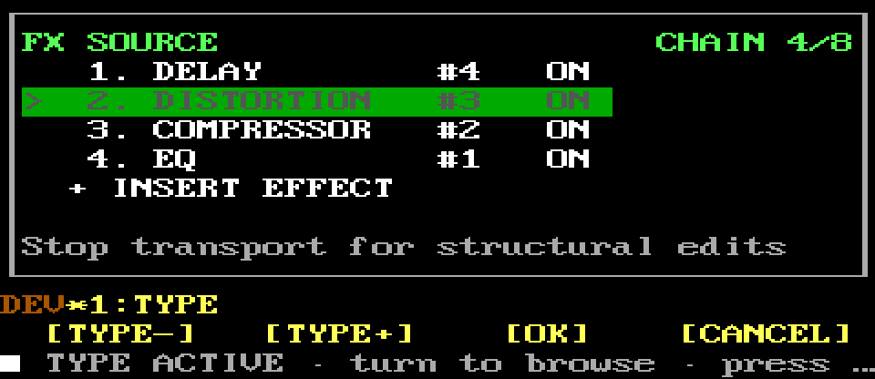

`TYPE-` and `TYPE+` browse compatible processors. `OK` confirms the new type;
`CANCEL` restores the original processor, or removes a newly inserted
provisional one. This context is distinct from `PARM`, which edits named
values without changing the processor type.

## FX parameter editor

Parameters come from strict persisted schemas, while each effect has a curated
performance layout of at most eight controls. At 40×13 those controls form two
rows of four columns that mirror the physical rotary positions. Each cell has
the parameter title above its type-aware value; clear names such as `RATE`,
`RATIO`, `ATTACK`, and `FEEDBACK` replace cryptic three-letter labels. Toggles
use ON/OFF, integers omit decimals, named modes/divisions use compact labels,
and dB, frequency, time, percent, and ratio keep musician-facing units.

EQ maps low, low-mid, high-mid, and high frequency across knobs 1–4, then the
matching four gains across knobs 5–8. Low cut is not placed on knob 1.
Secondary DSP values not assigned to a performance knob remain valid in saved
Projects, so this UI correction does not invalidate existing files.

The title/state uses one row and metering is bounded to one row. The compressor
shows 11 round red LEDs from 0.5 to 24 dB: dim circles keep the hardware-like
scale visible, while bright circles show live gain reduction and all stay dim
on bypass. Other processors use terse input/output values. Meter detail never
displaces a parameter.

Turn the rotary to select a control; click begins editing, turn changes only
that value, click confirms, and Back restores the original. Numeric keyboard
entry follows the same validation. There are no duplicate PARAM± or VALUE±
navigation buttons.

### STATE — bypass this processor

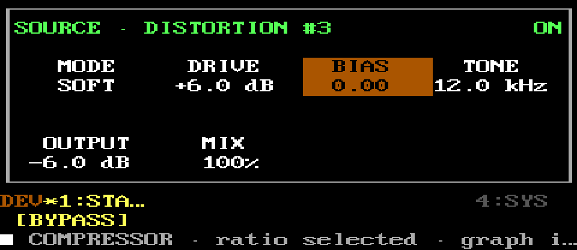

`BYPASS` toggles the edited processor without removing its ID, parameters, or
position. Bypass uses click-conscious smoothing in the active graph.

### SYS — safety and exit

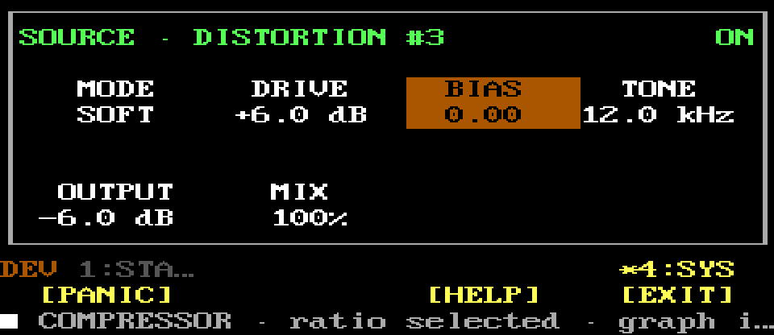

`PANIC` and `HELP` stay available. `EXIT` returns to the rack. Invalid or
non-finite parameter values are refused rather than published to audio.
