# FT2, Projects, and Patterns

[Manual home](../MENU_MANUAL.md) · [Everyday screens](EVERYDAY_SCREENS.md) ·
[Loops and effects](LOOPS_AND_EFFECTS.md)

SHR-DAW's FT2 screen is a compact vertical MIDI Pattern sequencer inspired by
tracker workflow. It is not an XM editor or a clone of FastTracker II. A
Project owns several Patterns and an Arrangement order. Each Pattern has one or
more four-lane pages. Portable `AUTO` pages defer destination and channels to
the active machine; explicit pages retain a destination plus each column's
channel, bank, and program.

The screenshots use a populated demonstration Project. External routes are
shown as offline where no actual device was opened for documentation.

At native 40×13 the Pattern body and compact page/lane footer end above the two
controller rows. The final row is the shared status row, so the tracker header
does not add a second `PLY`/`REC` label.

## FT2 Pattern — Play mode

Turn the main encoder to select the previous or next column, including across
page boundaries. Keyboard Up/Down still moves rows, and Left/right move the
order or lane. The shaded column is the live selection; the stronger yellow
cell cursor and highlighted row remain the next edit/play location.

### PLAY — transport and entry

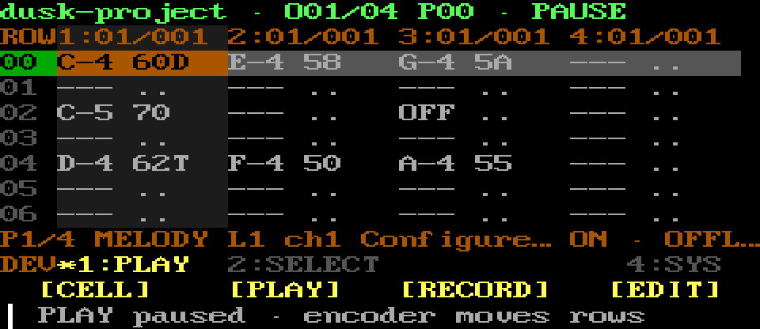

`CELL` opens the transactional editor. `PLAY` toggles tracker transport.
`RECORD` stops another active mode and starts the current Pattern record loop.
`EDIT` stops Play or REC before enabling note entry.

### SELECT — master overlays

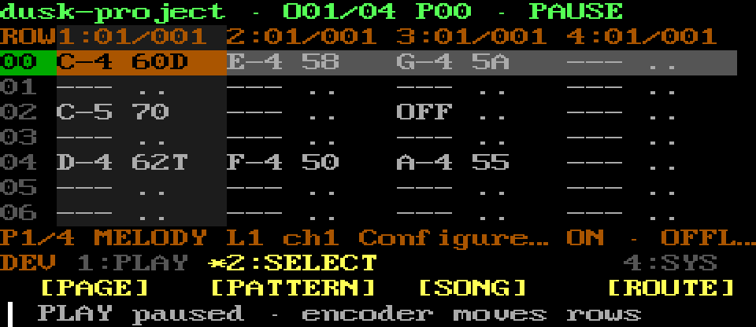

`PAGE`, `PATTERN`, `SONG`, and `ROUTE` open the reusable centered overlay while
the Pattern remains visible around it. Turn the master rotary or use Up/Down;
click/Enter selects. Only the highlighted launcher remains on the overlay's
bottom border near its original physical position; the final row remains the
shared status row. Press that same menu item, or keyboard Back/
Esc, to close. There is no extra controller Back item.

On 40×13 the outer border is 38×11 at `(1,1)` and its usable inner content is
36×9 at `(2,2)`.

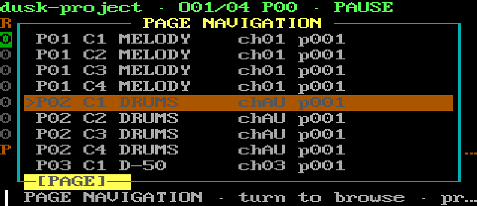

PAGE selects a page/column location and can open the detailed Tracks manager.

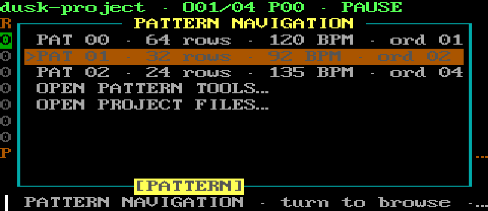

PATTERN selects an existing Pattern and links to Pattern tools or Project Files.

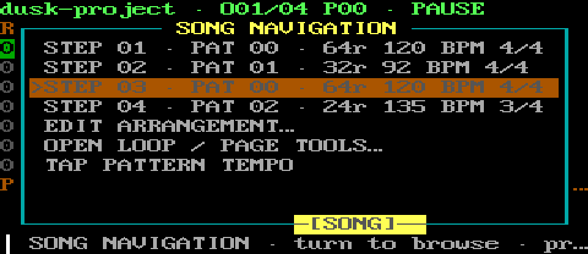

SONG selects an Arrangement step and links to Arrangement or page tools.

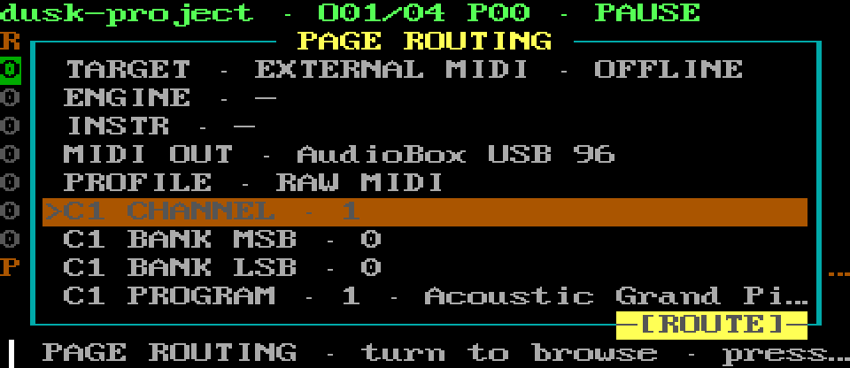

ROUTE edits a detached page-routing draft that changes the Project only on Apply.

### SYS — safety, filter, help, and exit

`PANIC` stops all owned notes and transports. `N00B` immediately toggles the
Player-selected scale filter without leaving Play. `HELP` opens contextual
help. `EXIT` returns Home.

## FT2 Pattern — real-time Record context

Record uses the selected page's exact online Pattern-owned software or hardware
instrument. Incoming notes are auditioned on that target/channel, quantized
into the current transport position, and written to the selected page. Between
notes, the rotary can select another column or page without restarting
recording or transport. Turns are ignored—not queued—while recorded notes
remain held, and work again after every matching Note Off. REC always owns its
Pattern loop; pressing REC again stops it and returns to stopped Play mode.
Key release writes a quantized note-off, independently of the Edit note-length
setting. New captures join playback on the next Pattern repetition.

### MODE — transport and capture

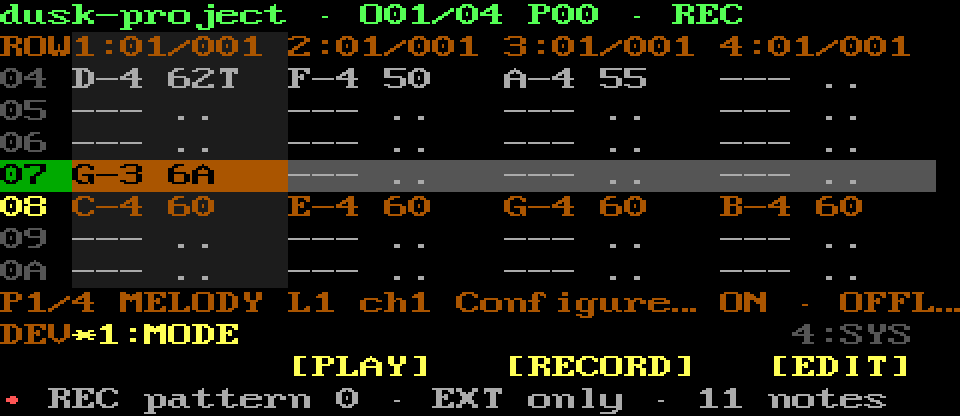

`PLAY` ends REC and starts normal transport. `RECORD` ends real-time capture
while preserving the notes already entered. `EDIT` ends REC and enters stopped
Edit mode. With N00B on, only allowed notes are heard and written.

### SYS — emergency and normal exits

`PANIC` performs the global owned stop. `N00B` toggles the same independent
filter without ending capture. `HELP` explains the current mode. `EXIT` leaves
the recording context safely.

## FT2 Pattern — Edit context

In Edit, a released melodic note writes immediately into the selected column.
Only overlapping notes that are physically held together form a chord and fill
subsequent columns. Command-pad notes are consumed as controls and are not doubled into
the Pattern or synth. The persistent ADD value chooses any advance from 0
through 32 rows after entry, blank, erase, or note-off; 0 stays on the current
row.

On a percussion page, entry searches earlier rows across all four columns and
reuses each drum voice's most recent column. New bass drums and snares prefer
columns 1 and 2; other new voices begin in columns 3 and 4. Occupied cells are
preserved, and simultaneous voices that want the same column fall through to a
free one. Melodic pages still fill from the selected column.

### MODE — leave Edit for Play or Record

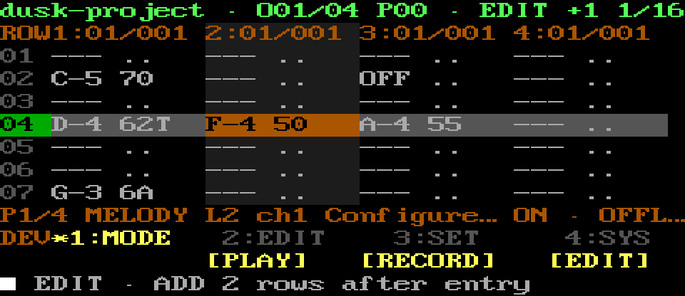

`PLAY` stops Edit and starts normal transport. `RECORD` stops Edit and starts
real-time capture from the first row. `EDIT` is the active mode; pressing it
again leaves Edit. Play, Record, and Edit are mutually exclusive.

### EDIT — enter or remove cells

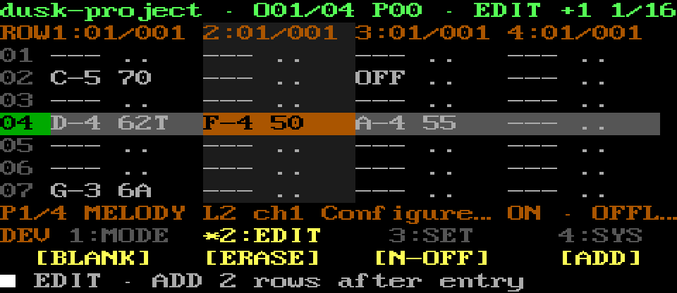

`BLANK` advances without writing a note. `ERASE` clears the selected cell.
`N-OFF` writes a note-off. `ADD` selects an advance from 0 through 32 rows.

### SET — rotary selectors

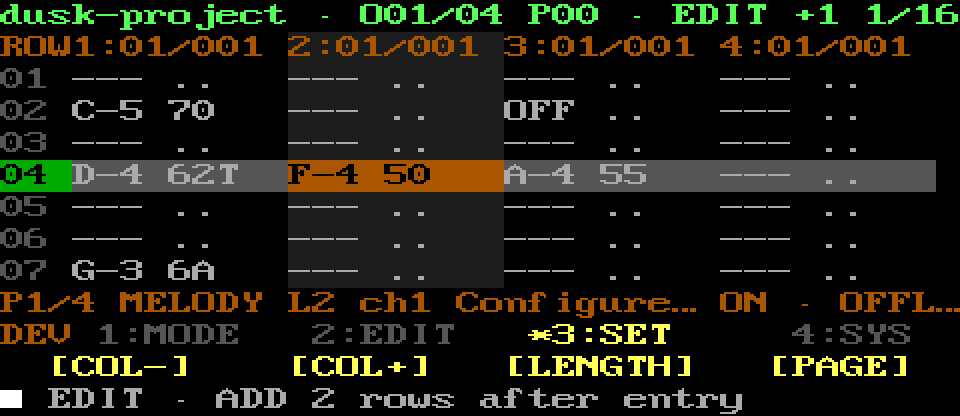

`COL-` and `COL+` move the edit cursor between the page's four note columns.
`LENGTH` opens note durations from 1/1 through 1/128. `PAGE` opens the same
page/column overlay used in Play. Turning browses, clicking selects, and Back
cancels without leaving Edit.

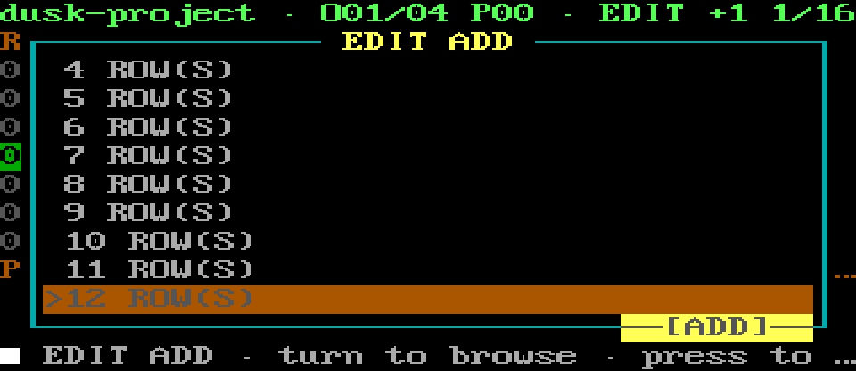

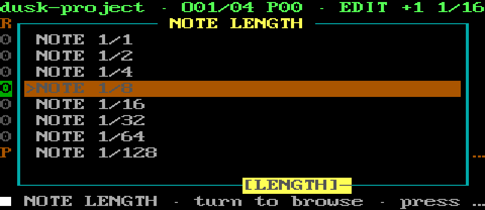

### SYS — safety, help, and leave edit

`PANIC` performs the owned stop. `N00B` toggles the same independent filter.
`HELP` opens contextual help. `EXIT` leaves Edit and returns to Play mode.

## FT2 Cell Edit

Cell Edit uses a draft copy: adjustments are not published until `CONFIRM`.
The cell can contain a note, inherited or explicit velocity, inherited or
explicit gate, an optional per-note program, and one command: cut, delay,
retrigger, tempo, or none.

### ROUTE — destination defaults for this cell

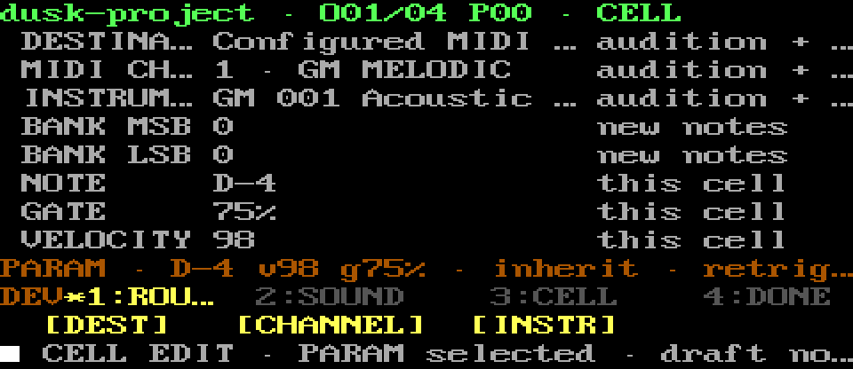

`DEST`, `CHANNEL`, and `INSTR` select the cell's route, channel, and inherited
instrument fields. Turning the master rotary adjusts the selected field in the
draft; the Pattern stays unchanged until `SAVE`.

### SOUND — banks and per-cell program

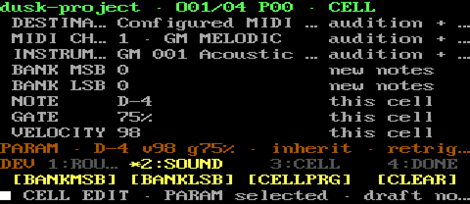

`BANKMSB`, `BANKLSB`, and `CELLPRG` select the sound-routing fields. `CLEAR`
clears only the selected field back to its inherited/default representation.
An explicit per-cell program is sent before that note on its exact target and
channel.

### CELL — musical content and command type

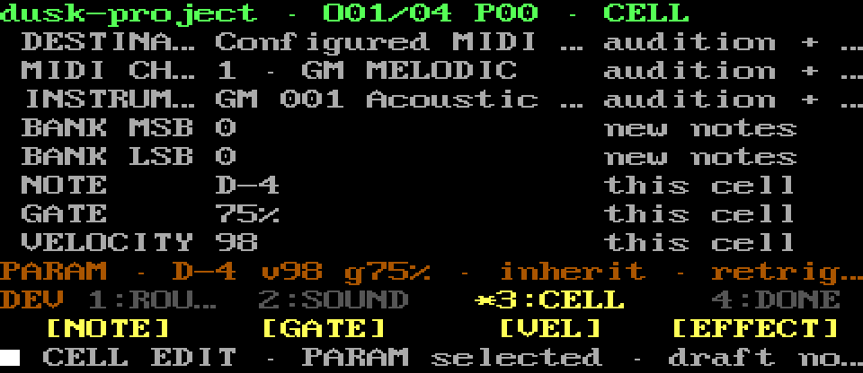

`NOTE`, `GATE`, and `VEL` select the corresponding value. Gate is a percentage
of one row; inherited values use the page/project default. `EFFECT` selects and
cycles cut, delay, retrigger, tempo, or none.

### DONE — save or cancel the draft

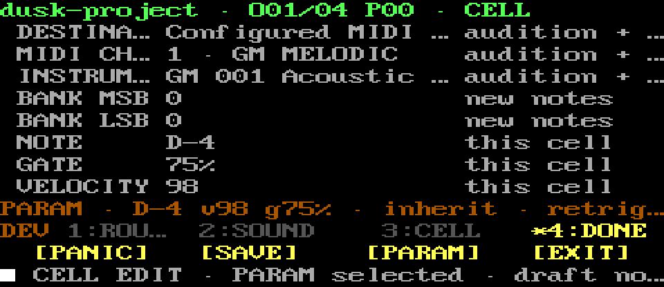

`PANIC` stays reachable. `SAVE` commits the whole draft. `PARAM` selects the
current command parameter. `EXIT` cancels and restores the original cell, so a
half-edited draft never leaks into the Project.

## FT2 Tools

This detailed child screen remains for Arrangement, clip operations, WAV loops,
effects, and muting. Open it from the SONG overlay's `OPEN LOOP / PAGE TOOLS` row.
Quick Page, Pattern, Song, and Route selection stays in the master overlays.

### OPS — open focused tools

`ARR` opens the Pattern order. `LOOP` opens WAV-loop setup. `FX` opens the
Project effects rack. `MUTE` toggles the selected lane.

### CLIP — lane and page clipboard

`COPY L`, `PASTE L`, `COPY PG`, and `PSTE PG` copy or paste the current lane or full
four-lane page. These are in-memory editing clipboards, not saved Projects.

### PAGE — page mute

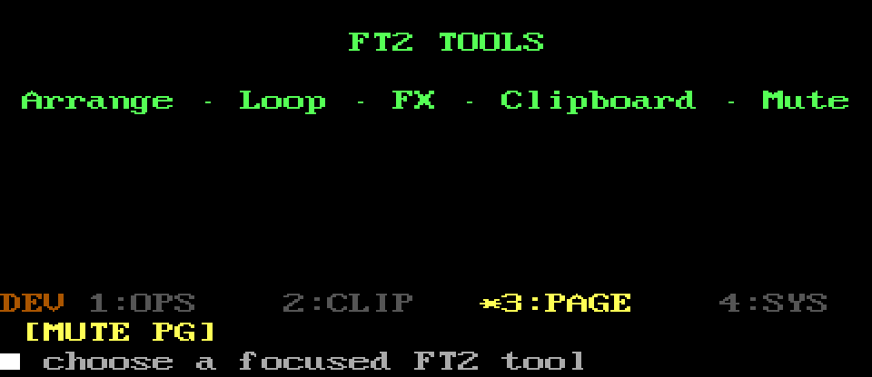

`MUTE PG` toggles the current four-lane page. Loop import, attachment, detach,
and alignment remain on the separate Loop screen opened from OPS.

### SYS — safety, help, and return

`PANIC` and `HELP` retain their normal meanings. `EXIT` returns to the
Pattern editor.

## N00B filter and Edit note length

N00B is an independent scale-filter switch, not a fourth FT2 mode and not a
duration control. Player owns the scale choice: enabling N00B there adds one
compact `SCALE` rotary to the unchanged Player screen, and turning the master
encoder cycles every chromatic root in major and natural minor. FT2 uses that
selection. On a melodic page, an in-scale key keeps its original pitch and an
out-of-scale key stays silent; no rejected key is shifted to a nearby note.
The FT2 button stays in the same SYS position, toggles the filter immediately,
and can stay on through Play, Record, and Edit; moving to Drums turns only the
filter off.

Note duration belongs separately to Edit. `LENGTH` opens an overlay for
`1/1` through `1/128`; it does not change the independent 0–32-row `ADD`
advance.

## Project Files

Files manages complete saved Projects. Names shown to the musician are
editable. Save and Save As publish atomically and never silently replace a
collision. Preview uses the selected saved Project without treating it as the
current edit.

### OPS — load, save, preview, delete

`LOAD` opens the selected Project. `SAVE` writes the current Project and asks
before replacement. `PREVIEW` starts or stops the selected Project preview.
`DELETE` requires repeat confirmation.

### PROJECT — lifecycle and Pattern child

`NEW` creates a confirmed blank Project. `SAVE AS` writes a numbered
non-overwriting copy. `NAME` edits the Project display name. `PATTERN` opens
Pattern tools.

### SYS — safety, help, and return

`PANIC` and `HELP` remain available. `EXIT` cancels pending file actions and
returns to the tracker.

When saving a changed blank Pattern, SHR can offer its routing as the private
default for future Patterns.

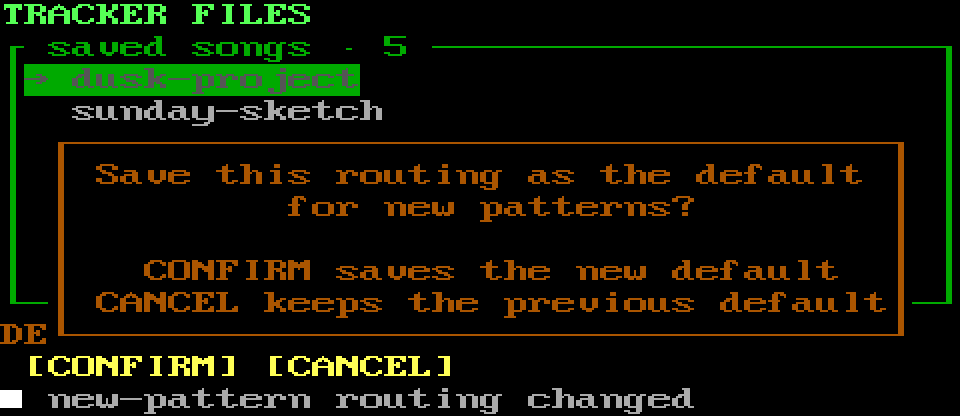

`CONFIRM` writes the template; `CANCEL` keeps the previous default.

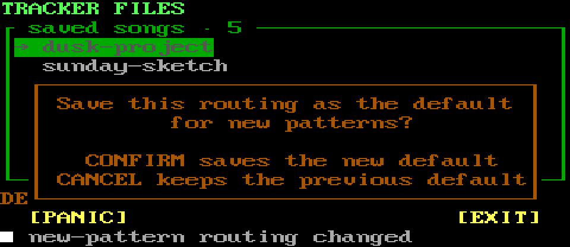

SYS keeps panic and exit/cancel reachable; neither choice changes notes.

## Pattern tools

Pattern tools operate on the Pattern referenced by the current Arrangement
step. Cleanup deletes only zero-reference Patterns; it never rewrites the
Arrangement behind the user's back. Transposition affects melodic pages only.

### OPS — Pattern lifecycle

`NEW` opens Pattern setup. `CLONE` creates a separate copy and selects it.
`CLEAR` opens a confirmed clear/resize setup. `DRUMS` opens reusable rhythms.

### CLIP — Pattern clipboard and cleanup

`COPY` stores the current Pattern in memory. `NEW` creates a new Pattern from
it. `OVER` asks before replacing the current Pattern. `CLEAN` deletes
only Patterns not referenced by any Arrangement step.

### TRANS — transpose melody only

`OCT-`, `NOTE-`, `NOTE+`, and `OCT+` transpose melodic notes by −12, −1, +1,
or +12 semitones. Percussion pages and note-off commands are left unchanged.

### SYS — safety, help, and return

`PANIC` and `HELP` stay available. `EXIT` returns to Project Files.

## Drum patterns

The library contains bundled read-only grooves plus user-saved four-lane drum
Patterns. Filters select genre, 3/4 or 4/4, and supported two-, four-, or
eight-bar row sizes. Loading may resize an empty melodic Pattern, but refuses a
shape change once melody exists.

### OPS — load and manage a rhythm

`LOAD` writes the selected rhythm into the percussion page without changing
its route. `SAVE` stores the current percussion page as a user rhythm.
`DELETE` can remove only a user save and requires confirmation.

### FILTER — narrow the library

`GENRE-` and `GENRE+` move among the available genres and `ALL`. `METER`
toggles 3/4 and 4/4. `SIZE` cycles the supported Pattern lengths for that meter.

### MOVE — navigate a long result list

`FIRST` and `LAST` move to the filtered result-list boundaries without loading
anything. Turn the rotary for one-step movement, type a first letter to jump,
or use keyboard PageUp/PageDown for coarse scrolling; physical pads omit the
coarse page commands.

### SYS — safety, help, and return

`PANIC` and `HELP` remain available. `EXIT` returns to Pattern tools.

## Pattern setup

This confirmation context chooses musical meter and row count before a new or
destructively cleared Pattern is created. `LNGTH` opens a rotary overlay with
every row count from 1 through 32 plus 48, 64, 96, 128, 192, and 256.

### OPS — meter and size

`3/4` and `4/4` choose the meter without silently changing the row count.
`LNGTH` opens the row-count overlay; turning browses and clicking keeps the
highlighted value in the still-unconfirmed Pattern setup.

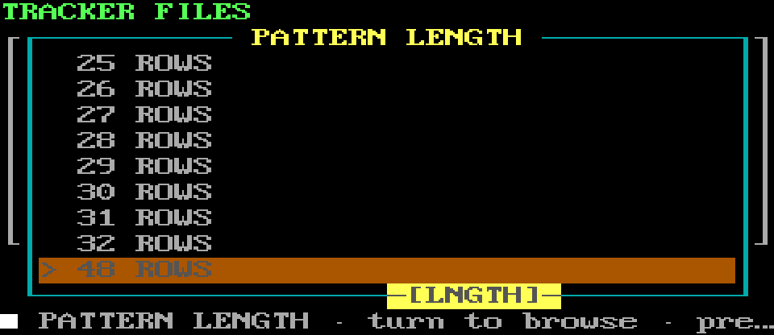

### APPLY — confirm or preserve

`CONFIRM` performs the new/clear operation with the displayed shape. `KEEP`
cancels the destructive reset and retains the current Pattern size.

### SYS — safety and cancellation

`PANIC` and `HELP` remain available. `EXIT` cancels the setup and returns to
Pattern tools.

## Arrangement

Arrangement is the ordered list of Pattern IDs that forms the Project
timeline. Repeated steps reference the same Pattern until it is cloned.

### OPS — play and insert Pattern references

`PLAY` starts at the selected step. `JUMP` opens that step's Pattern in the
editor. `APPEND` adds the current Pattern at the end. `INSERT` adds it before
the selected step.

### STEP — reorder and repeat

`UP` and `DOWN` move the selected step earlier or later. `REPEAT` duplicates
the reference. `REMOVE` removes only this step, not the underlying Pattern.

### SYS — safety, help, and return

`PANIC` and `HELP` remain available. `EXIT` returns to the tracker.

## ROUTE master overlay

ROUTE is the quick transactional editor for the active Pattern page. The top
row shows the page/master destination and its current resolved state. The next
16 rows show channel, bank MSB, bank LSB, and program/instrument for each of the
page's four columns; profile-provided instrument names appear when available.
Long hardware names are deliberately shortened inside the border.

Turn to a row and click/Enter to make that field active. Only then does rotary
movement change the detached draft. Click/Enter keeps the field in the draft;
Back/Esc restores that field's prior value. `APPLY ROUTING` validates and
copies the page through the existing Project owner, releases old auditions,
and runs the existing route synchronization. Until Apply, the Project, runtime
route, engine, transport, and recorder are untouched.

Pressing the highlighted `ROUTE` menu item closes the overlay and cancels its
whole unconfirmed draft. Back/Esc from the main list does the same. Missing
preferred hardware remains visible and saved as preferred; an exact external
target may use only the configured hardware fallback and never the Pattern's
software synth. `AUTO` keeps its portable machine-default behavior and owns its
channel/bank/program values.

## Tracks and routing

The Tracks screen edits four-lane pages. Changes are kept as a draft until
`DONE`; `EXIT` restores the original Project. Turn the encoder to choose a page
in normal mode. A destination is shared by the page, while channel, bank, and
program belong to the selected column.

Open it from the PAGE overlay's `MANAGE PAGES / TRACKS` row. It intentionally
remains a full screen because adding pages and coordinating several fields is
more detailed than quick overlay navigation.

### OPS — add and route pages

`ADD` adds one four-lane page. `TARGET` opens the destination field. `CHANNEL`
opens the selected column's MIDI channel field. `DONE` validates conflicts and
keeps all page-manager changes.

### COLUMN — choose column and program

`COL-` and `COL+` select one of the page's four columns. `PROG-` and `PROG+`
choose its 0–127 program, using a device profile's name when available.

### BANK — choose the selected column's bank

`MSB-`, `MSB+`, `LSB-`, and `LSB+` adjust the MIDI bank-select bytes for the
selected column. The configured bank-select order is honored during playback.

### SYS — safety, help, and cancel

`PANIC` and `HELP` remain available. `EXIT` cancels the entire Tracks draft and
restores the original Project.

## Target field editor

The target field lists discovered synthv1 presets, the configured external
route, and discovered named MIDI outputs. A synth choice belongs to the Pattern,
not the standalone Software Synth workspace. Offline selections are retained in
the Project rather than silently rewritten.

### OPS — confirm destination

Turn the encoder to choose a device. `CONFIRM` applies the field to the draft
page and returns to Tracks. On eight- and five-button layouts, encoder press is
also confirm.

### SYS — cancel only this field

`PANIC` and `HELP` stay available. `EXIT` cancels only the target field and
returns to the unchanged Tracks draft.

## Channel field editor

Channel editing affects only the selected column. The visible value is 1–16;
the persisted MIDI byte remains the standard zero-based 0–15 representation.

### OPS — confirm channel

Turn the encoder to choose 1–16. `CONFIRM` applies the field and returns to
Tracks. Encoder press also confirms on eight- and five-button layouts.

### SYS — cancel only this field

`PANIC` and `HELP` stay available. `EXIT` discards only the channel draft and
returns to Tracks.
