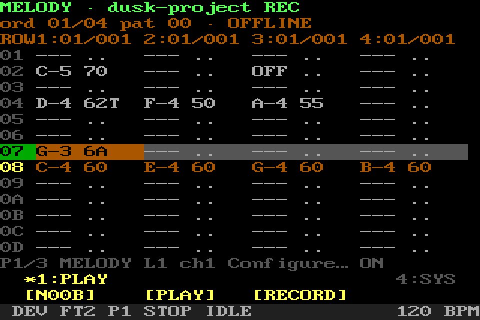

# FT2, Projects, and Patterns

[Manual home](../MENU_MANUAL.md) · [Everyday screens](EVERYDAY_SCREENS.md) ·
[Loops and effects](LOOPS_AND_EFFECTS.md)

SHR-DAW's FT2 screen is a compact vertical MIDI Pattern sequencer inspired by
tracker workflow. It is not an XM editor or a clone of FastTracker II. A
Project owns several Patterns and an Arrangement order. Each Pattern has one or
more four-lane pages. Portable `AUTO` pages defer destination and channels to
the active machine; explicit pages retain a destination plus each column's
channel, bank, and program.

The screenshots use a populated demonstration Project. External routes are
shown as offline where no actual device was opened for documentation.

## FT2 Pattern — Play mode

Turn the main encoder to move through rows. Left/right move the order or lane
with the keyboard. The highlighted row is the next edit/play location.

### MOVE — page and track navigation

`PAGE-` and `PAGE+` move between the Pattern's four-track pages. `TRACK-` and
`TRACK+` move the column cursor, crossing a page boundary when needed. These
high-value tracker movements occupy controller page 1.

### PLAY — transport and entry

`CELL` opens the transactional editor. `PLAY` toggles tracker transport. From
Stop, `RECORD` starts the current Pattern record loop; from Play it punches in
without moving the playhead. `STEP` toggles step entry.

### NAV — master overlays

`PAGE`, `PATTERN`, `SONG`, and `ROUTE` open the reusable centered overlay while
the Pattern remains visible around it. Turn the master rotary or use Up/Down;
click/Enter selects. Only the highlighted launcher remains on the bottom row in
its original physical position. Press that same menu item, or keyboard Back/
Esc, to close. There is no extra controller Back item.

PAGE browses page/column locations and links to the detailed Tracks manager.
PATTERN browses the Project's existing Patterns and links to Pattern tools and
Project Files. SONG browses Arrangement steps and links to the detailed
Arrangement, Loop/page tools, and tap tempo. ROUTE transactionally edits the
active page's destination and four column setups. On 40×20 the outer border is
38×18 at `(1,1)` and its usable inner content is 36×16 at `(2,2)`.

The old NAV-page screenshot is intentionally not regenerated until physical
40×20 approval; this text and the controller map describe the current build.

### SYS — stop, tools, and exit

`PANIC` stops all owned notes and transports. `N00B` opens scale setup or turns
an active filter off without leaving Play. `HELP` opens contextual help. `EXIT`
returns Home.

## FT2 Pattern — real-time Record context

Record is allowed only on a page routed to external MIDI. Incoming notes are
consumed before the loaded software synth, auditioned on that page's exact
target/channel, quantized into the current transport position, and written only
to that page. Recording started from Stop loops the current Pattern; punch
recording follows the already-playing Arrangement without restarting it.

### PLAY — transport, capture, and filter

`N00B` opens scale setup or turns the active filter off without ending capture.
`PLAY` controls transport. `RECORD` ends real-time capture while preserving the
notes already entered: it returns to Play after a punch-in, or stops after
recording was started from Stop. With N00B on, only allowed notes are heard and
written.

### SYS — emergency and normal exits

`PANIC` performs the global owned stop. `HELP` explains the current mode.
`EXIT` leaves the recording context safely.

## FT2 Pattern — Step Edit context

In Step Edit, a computer key or incoming MIDI gesture writes a note or chord at
the cursor. Command-pad notes are consumed as controls and are not doubled into
the Pattern or synth. The persistent ADD value chooses how many rows the cursor
advances after entry, blank, erase, or note-off.

On a percussion page, entry searches earlier rows across all four columns and
reuses each drum voice's most recent column. New bass drums and snares prefer
columns 1 and 2; other new voices begin in columns 3 and 4. Occupied cells are
preserved, and simultaneous voices that want the same column fall through to a
free one. Melodic pages still fill from the selected column.

### OPS — enter or remove cells

`BLANK` advances without writing a note. `ERASE` clears the selected cell.
`N-OFF` writes a note-off. `N00B` opens scale setup or turns the active filter
off while Step Edit remains active.

### MOVE — order and lane cursor

`PG-`, `PG+`, `LANE-`, and `LANE+` move the edit cursor without changing
Pattern data.

### ADD — choose row advance

`1`, `2`, `4`, and `8` set the persistent number of rows added after each step
operation. This affects movement, not note duration or tempo.

### SYS — stop, next page, and leave edit

`PANIC` and `STOP` retain their safety meanings. `PAGE` moves to the next
four-lane page. `EXIT` leaves Step Edit and returns to Play mode.

## FT2 Cell Edit

Cell Edit uses a draft copy: adjustments are not published until `CONFIRM`.
The cell can contain a note, inherited or explicit velocity, inherited or
explicit gate, an optional per-note program, and one command: cut, delay,
retrigger, tempo, or none.

### OPS — commit and change command type

`CONFIRM` commits the whole draft. `STEP` commits and hands off to Step Edit.
`CLEAR` clears only the selected field. `EFFECT` cycles the command type.

### FIELDS — select the value to edit

`NOTE`, `GATE`, `VEL`, and `PROGRAM` select the corresponding field. Gate is a
percentage of one row; inherited values use the page/project default. Program
is sent before that note on the exact target and channel.

### ADJUST — command parameter and value

`PARAM` selects the current command's parameter. `VALUE-` and `VALUE+` adjust
the selected field within its validated range. Turning the encoder performs
the same adjustment.

### SYS — cancel without partial edits

`PANIC` stays reachable. `EXIT` cancels and restores the original
cell, so a half-edited draft never leaks into the Project.

## FT2 Tools

This detailed child screen remains for Arrangement, clip operations, WAV loops,
N00B, and muting. Open it from the SONG overlay's `OPEN LOOP / PAGE TOOLS` row.
Quick Page, Pattern, Song, and Route selection stays in the master overlays.

### OPS — open focused tools

`ARR` opens the Pattern order. `LOOP` opens WAV-loop setup. `N00B` toggles the
scale filter on a melodic page. `MUTE` toggles the selected lane.

### CLIP — lane and page clipboard

`COPY L`, `PASTE L`, `COPY PG`, and `PSTE PG` copy or paste the current lane or full
four-lane page. These are in-memory editing clipboards, not saved Projects.

### PAGE — page mute

`MUTE PG` toggles the current four-lane page. Loop import, detach, alignment,
and private-library cleanup remain on the separate Loop screen opened from OPS.

### SYS — safety, help, and return

`PANIC` and `HELP` retain their normal meanings. `EXIT` returns to the
Pattern editor.

## N00B filter and Step Edit note length

N00B is an independent scale-filter switch, not a fourth FT2 mode and not a
duration control. Choose any chromatic root plus major or natural minor. On the
selected melodic page, an in-scale key keeps its original pitch and an
out-of-scale key stays silent; no rejected key is shifted to a nearby note.
The filter can stay on while playing, recording, or using Step Edit. Play does
not write cells; Record and Step Edit write only allowed notes. The N00B button
is reachable in all three modes and turns the active filter off without
changing mode. Moving onto Drums also turns only the filter off.

Note duration belongs separately to Step Edit. `LENGTH` opens a rotary selector
for `1/1`, `1/2`, `1/4`, `1/8`, `1/16`, and `1/32`; `1/16` is the default.
The duration uses the existing gate/note-off representation. It does not alter
the independent 1/2/4/8-row `ADD` value that chooses the next insertion row.

## Project Files

Files manages complete saved Projects. Names shown to the musician are
editable. Save and Save As publish atomically and never silently replace a
collision. Preview uses the selected saved Project without treating it as the
current edit.

### OPS — load, save, preview, delete

`LOAD` opens the selected Project. `SAVE` writes the current Project and asks
before replacement. `PREVIEW` starts or stops the selected Project preview.
`DELETE` requires repeat confirmation.

### PROJECT — lifecycle and Pattern child

`NEW` creates a confirmed blank Project. `SAVE AS` writes a numbered
non-overwriting copy. `NAME` edits the Project display name. `PATTERN` opens
Pattern tools.

### SYS — stop and return

`PANIC`, `STOP`, and `HELP` remain available. `EXIT` cancels pending file
actions and returns to the tracker.

## Pattern tools

Pattern tools operate on the Pattern referenced by the current Arrangement
step. Cleanup deletes only zero-reference Patterns; it never rewrites the
Arrangement behind the user's back. Transposition affects melodic pages only.

### OPS — Pattern lifecycle

`NEW` opens Pattern setup. `CLONE` creates a separate copy and selects it.
`CLEAR` opens a confirmed clear/resize setup. `DRUMS` opens reusable rhythms.

### CLIP — Pattern clipboard and cleanup

`COPY` stores the current Pattern in memory. `NEW` creates a new Pattern from
it. `OVER` asks before replacing the current Pattern. `CLEAN` deletes
only Patterns not referenced by any Arrangement step.

### TRANS — transpose melody only

`OCT-`, `NOTE-`, `NOTE+`, and `OCT+` transpose melodic notes by −12, −1, +1,
or +12 semitones. Percussion pages and note-off commands are left unchanged.

### SYS — stop and return

`PANIC`, `STOP`, and `HELP` stay available. `EXIT` returns to Project Files.

## Drum patterns

The library contains bundled read-only grooves plus user-saved four-lane drum
Patterns. Filters select genre, 3/4 or 4/4, and supported two-, four-, or
eight-bar row sizes. Loading may resize an empty melodic Pattern, but refuses a
shape change once melody exists.

### OPS — load and manage a rhythm

`LOAD` writes the selected rhythm into the percussion page without changing
its route. `SAVE` stores the current percussion page as a user rhythm.
`DELETE` can remove only a user save and requires confirmation.

### FILTER — narrow the library

`GENRE-` and `GENRE+` move among the available genres and `ALL`. `METER`
toggles 3/4 and 4/4. `SIZE` cycles the supported Pattern lengths for that meter.

### MOVE — navigate a long result list

`FIRST` and `LAST` move to the filtered result-list boundaries without loading
anything. Turn the rotary for one-step movement, type a first letter to jump,
or use keyboard PageUp/PageDown for coarse scrolling; physical pads omit the
coarse page commands.

### SYS — stop and return

`PANIC`, `STOP`, and `HELP` remain available. `EXIT` returns to Pattern tools.

## Pattern setup

This confirmation context chooses musical meter and row count before a new or
destructively cleared Pattern is created. The supported sizes represent two,
four, eight, sixteen, or thirty-two bars in the selected meter.

### OPS — meter and size

`3/4` and `4/4` choose the meter. `SIZE-` and `SIZE+` move among the matching
row counts. Turning the encoder also changes size.

### APPLY — confirm or preserve

`CONFIRM` performs the new/clear operation with the displayed shape. `KEEP`
cancels the destructive reset and retains the current Pattern size.

### SYS — safety and cancellation

`PANIC` and `HELP` remain available. `EXIT` cancels the setup and returns to
Pattern tools.

## Arrangement

Arrangement is the ordered list of Pattern IDs that forms the Project
timeline. Repeated steps reference the same Pattern until it is cloned.

### OPS — play and insert Pattern references

`PLAY` starts at the selected step. `JUMP` opens that step's Pattern in the
editor. `APPEND` adds the current Pattern at the end. `INSERT` adds it before
the selected step.

### STEP — reorder and repeat

`UP` and `DOWN` move the selected step earlier or later. `REPEAT` duplicates
the reference. `REMOVE` removes only this step, not the underlying Pattern.

### SYS — stop and return

`PANIC` and `HELP` remain available. `EXIT` returns to the tracker.

## ROUTE master overlay

ROUTE is the quick transactional editor for the active Pattern page. The top
row shows the page/master destination and its current resolved state. The next
16 rows show channel, bank MSB, bank LSB, and program/instrument for each of the
page's four columns; profile-provided instrument names appear when available.
Long hardware names are deliberately shortened inside the border.

Turn to a row and click/Enter to make that field active. Only then does rotary
movement change the detached draft. Click/Enter keeps the field in the draft;
Back/Esc restores that field's prior value. `APPLY ROUTING` validates and
copies the page through the existing Project owner, releases old auditions,
and runs the existing route synchronization. Until Apply, the Project, runtime
route, engine, transport, and recorder are untouched.

Pressing the highlighted `ROUTE` menu item closes the overlay and cancels its
whole unconfirmed draft. Back/Esc from the main list does the same. Missing
preferred hardware remains visible and saved as preferred; an exact external
target may use only the configured hardware fallback and never the Pattern's
software synth. `AUTO` keeps its portable machine-default behavior and owns its
channel/bank/program values.

## Tracks and routing

The Tracks screen edits four-lane pages. Changes are kept as a draft until
`DONE`; `EXIT` restores the original Project. Turn the encoder to choose a page
in normal mode. A destination is shared by the page, while channel, bank, and
program belong to the selected column.

Open it from the PAGE overlay's `MANAGE PAGES / TRACKS` row. It intentionally
remains a full screen because adding pages and coordinating several fields is
more detailed than quick overlay navigation.

### OPS — add and route pages

`ADD` adds one four-lane page. `TARGET` opens the destination field. `CHANNEL`
opens the selected column's MIDI channel field. `DONE` validates conflicts and
keeps all page-manager changes.

### COLUMN — choose column and program

`COL-` and `COL+` select one of the page's four columns. `PROG-` and `PROG+`
choose its 0–127 program, using a device profile's name when available.

### BANK — choose the selected column's bank

`MSB-`, `MSB+`, `LSB-`, and `LSB+` adjust the MIDI bank-select bytes for the
selected column. The configured bank-select order is honored during playback.

### SYS — mute, cancel, and safety

`PANIC` and `STOP` remain available. `MUTE` toggles the whole current page.
`EXIT` cancels the entire Tracks draft and restores the original Project.

## Target field editor

The target field lists discovered synthv1 presets, the configured external
route, and discovered named MIDI outputs. A synth choice belongs to the Pattern,
not the standalone Software Synth workspace. Offline selections are retained in
the Project rather than silently rewritten.

### OPS — confirm destination

Turn the encoder to choose a device. `CONFIRM` applies the field to the draft
page and returns to Tracks. On eight- and five-button layouts, encoder press is
also confirm.

### SYS — cancel only this field

`PANIC`, `STOP`, and `HELP` stay available. `EXIT` cancels only the target
field and returns to the unchanged Tracks draft.

## Channel field editor

Channel editing affects only the selected column. The visible value is 1–16;
the persisted MIDI byte remains the standard zero-based 0–15 representation.

### OPS — confirm channel

Turn the encoder to choose 1–16. `CONFIRM` applies the field and returns to
Tracks. Encoder press also confirms on eight- and five-button layouts.

### SYS — cancel only this field

`PANIC`, `STOP`, and `HELP` stay available. `EXIT` discards only the channel
draft and returns to Tracks.
