# FT2, Projects, and Patterns

[Manual home](../MENU_MANUAL.md) · [Everyday screens](EVERYDAY_SCREENS.md) ·
[Loops and effects](LOOPS_AND_EFFECTS.md)

SHR-DAW's FT2 screen is a compact vertical MIDI Pattern sequencer inspired by
tracker workflow. It is not an XM editor or a clone of FastTracker II. A
Project owns several Patterns and an Arrangement order. Each Pattern has one or
more four-lane pages; a page selects a MIDI destination, while each of its four
columns retains a channel, bank, and program.

The screenshots use a populated demonstration Project. External routes are
shown as offline where no actual device was opened for documentation.

## FT2 Pattern — Play mode

Turn the main encoder to move through rows. Left/right move the order or lane
with the keyboard. The highlighted row is the next edit/play location.

### OPS — transport and entry

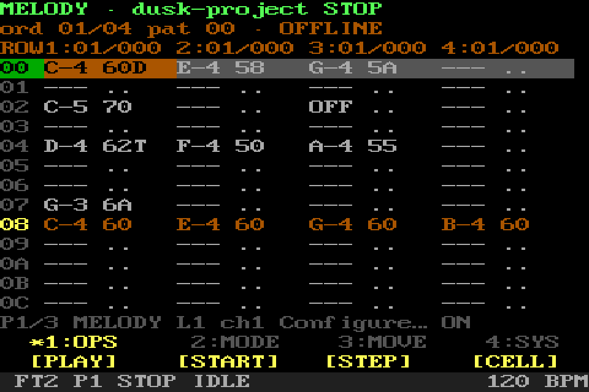

`HERE` plays from the highlighted row. `START` plays from the beginning of the
Arrangement. `STEP` enters Step Edit. `CELL` opens the transactional editor for
the selected cell.

### MODE — choose one tracker mode

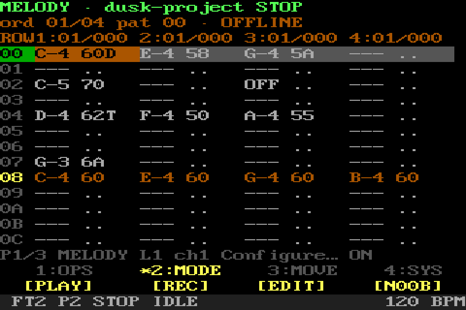

`PLAY` selects normal navigation. `RECORD` begins real-time recording on the
current external-MIDI page only. `EDIT` enables step entry. `N00B` opens scale
setup before enabling simplified live-note mapping.

### MOVE — order and lane cursor

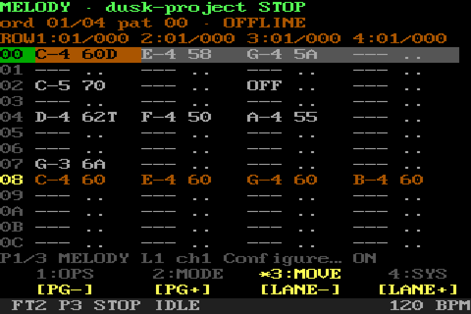

`ORD-` and `ORD+` move between Arrangement steps. `LANE-` and `LANE+` move the
cursor across the current four-lane page.

### SYS — stop, tools, and exit

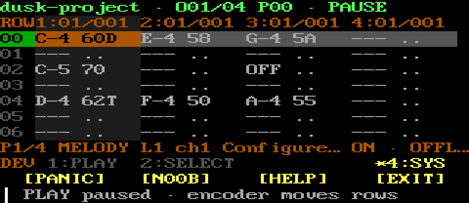

`PANIC` stops all owned notes and transports. `STOP` stops the tracker and loop
transport. `TOOLS` opens the FT2 Tools child. `EXIT` returns one level.

## FT2 Pattern — real-time Record context

Record is allowed only on a page routed to external MIDI. Incoming notes are
consumed before the loaded software synth, auditioned on that page's exact
target/channel, quantized into the looping current Pattern, and written only to
that page.

### OPS — finish recording

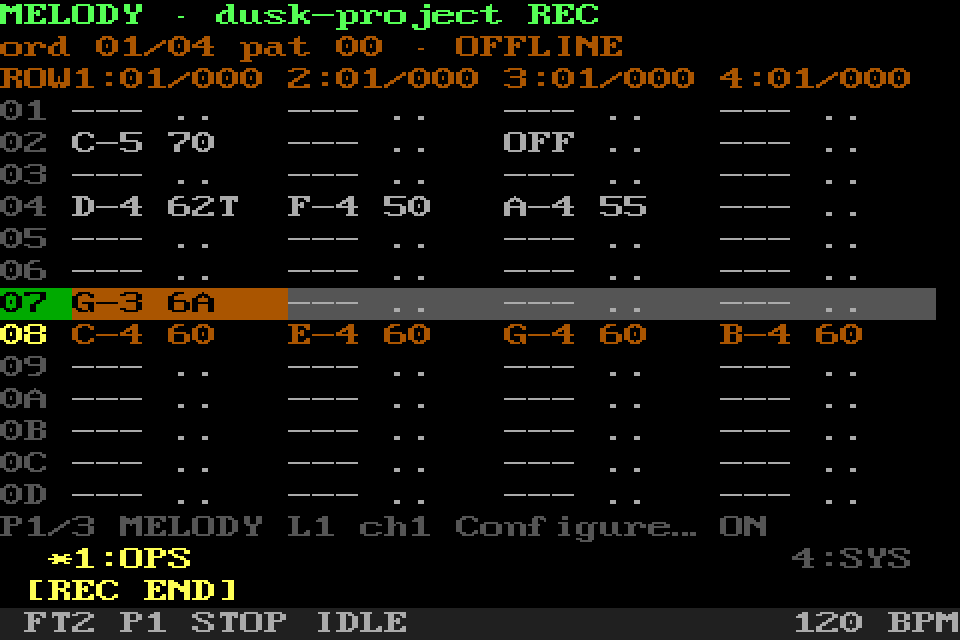

`REC END` ends real-time capture while preserving the notes already entered.

### SYS — emergency and normal exits

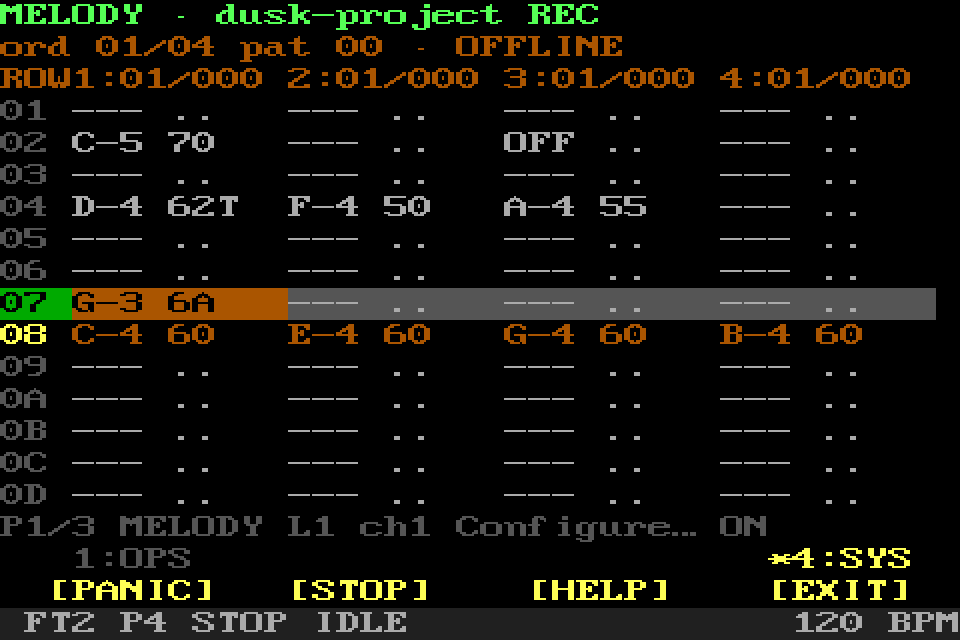

`PANIC` performs the global owned stop. `STOP` stops transport and recording.
`HELP` explains the current mode. `EXIT` leaves the recording context safely.

## FT2 Pattern — Step Edit context

In Step Edit, a computer key or incoming MIDI gesture writes a note or chord at
the cursor. Command-pad notes are consumed as controls and are not doubled into
the Pattern or synth. The persistent ADD value chooses how many rows the cursor
advances after entry, blank, erase, or note-off.

### OPS — enter or remove cells

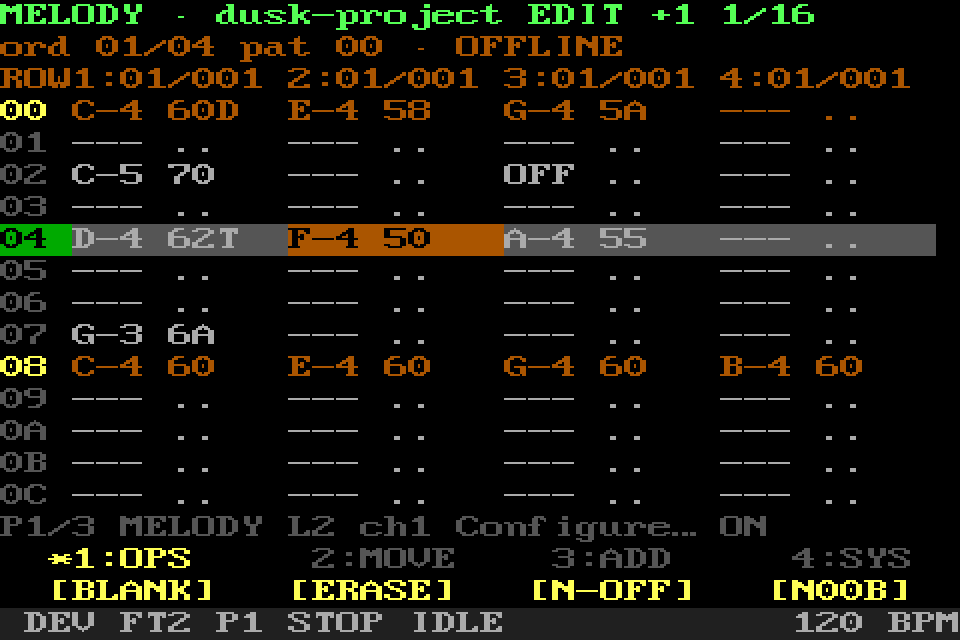

`BLANK` advances without writing a note. `ERASE` clears the selected cell.
`N-OFF` writes a note-off. `DONE` leaves Step Edit.

### MOVE — order and lane cursor

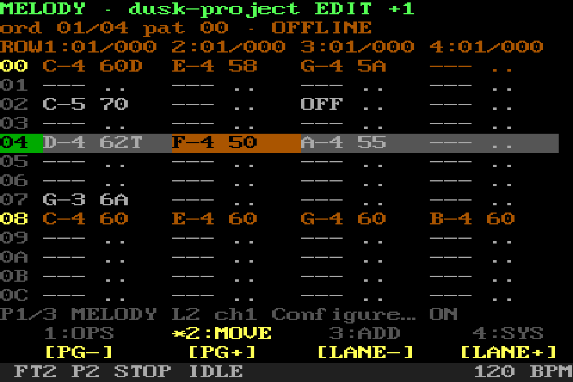

`ORD-`, `ORD+`, `LANE-`, and `LANE+` move the edit cursor without changing
Pattern data.

### ADD — choose row advance

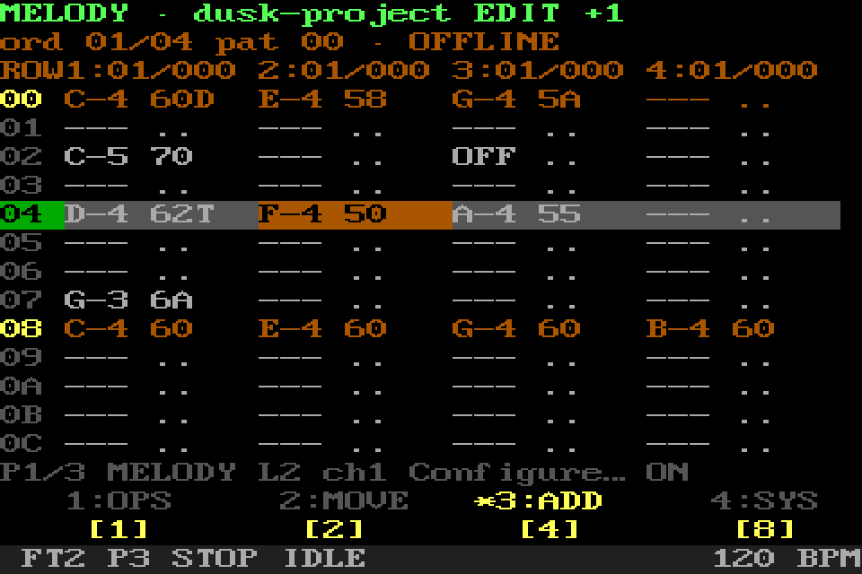

`1`, `2`, `4`, and `8` set the persistent number of rows added after each step
operation. This affects movement, not note duration or tempo.

### SYS — stop, next page, and leave edit

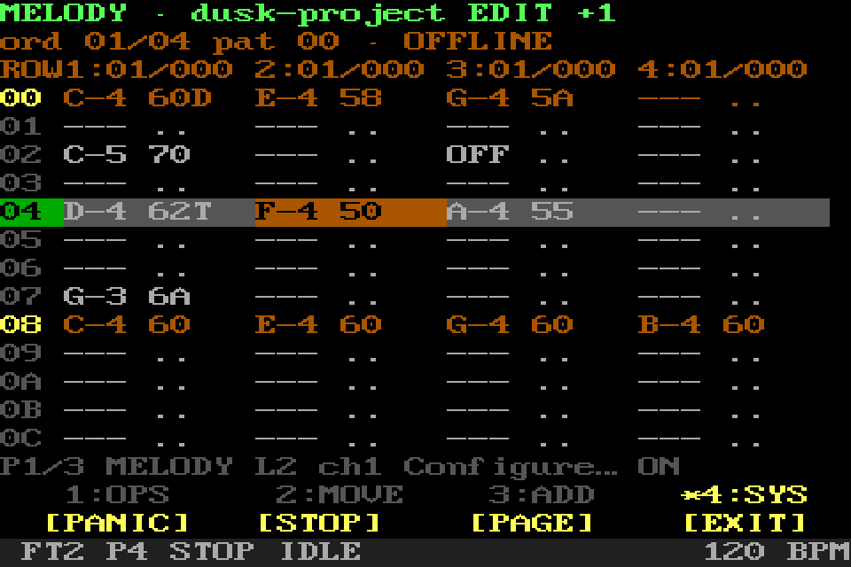

`PANIC` and `STOP` retain their safety meanings. `NXT PG` moves to the next
four-lane page. `EXIT` leaves Step Edit and returns to Play mode.

## FT2 Cell Edit

Cell Edit uses a draft copy: adjustments are not published until `CONFIRM`.
The cell can contain a note, inherited or explicit velocity, inherited or
explicit gate, an optional per-note program, and one command: cut, delay,
retrigger, tempo, or none.

### OPS — commit and change command type

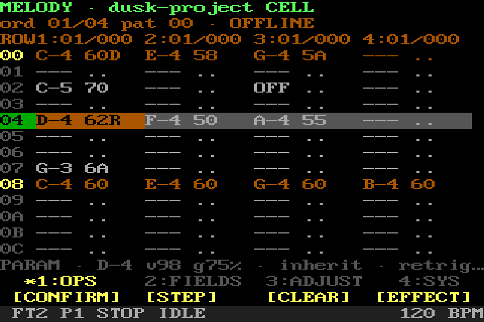

`CONFIRM` commits the whole draft. `STEP` commits and hands off to Step Edit.
`CLEAR` clears only the selected field. `EFFECT` cycles the command type.

### FIELDS — select the value to edit

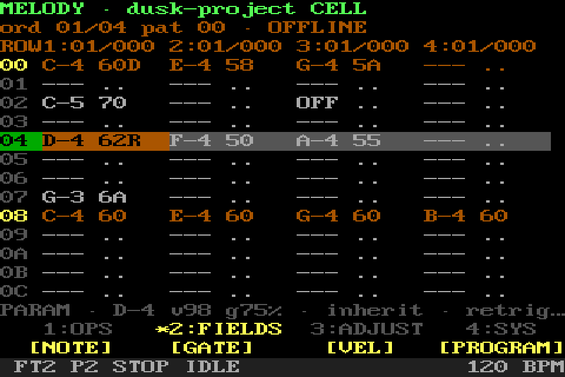

`NOTE`, `GATE`, `VEL`, and `PROGRAM` select the corresponding field. Gate is a
percentage of one row; inherited values use the page/project default. Program
is sent before that note on the exact target and channel.

### ADJUST — command parameter and value

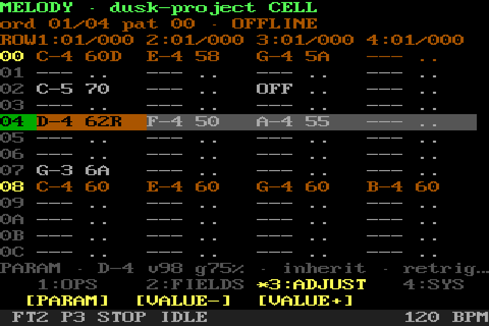

`PARAM` selects the current command's parameter. `VALUE-` and `VALUE+` adjust
the selected field within its validated range. Turning the encoder performs
the same adjustment.

### SYS — cancel without partial edits

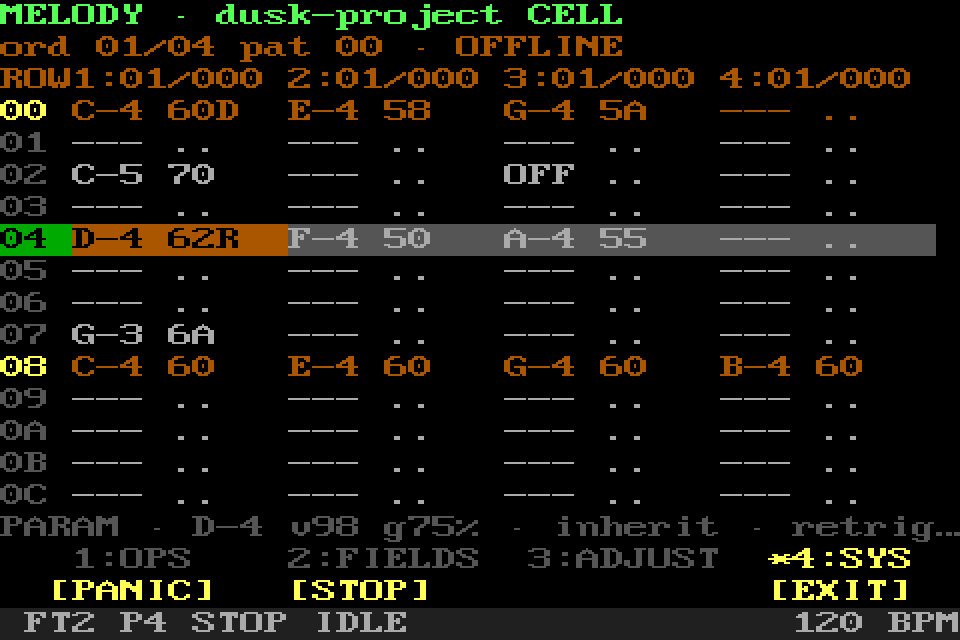

`PANIC` and `STOP` stay reachable. `EXIT` cancels and restores the original
cell, so a half-edited draft never leaks into the Project.

## FT2 Tools

This child screen keeps the main Pattern screen compact. It routes to track
configuration, Project files, Arrangement, clip operations, and WAV loops.

### OPS — open focused tools

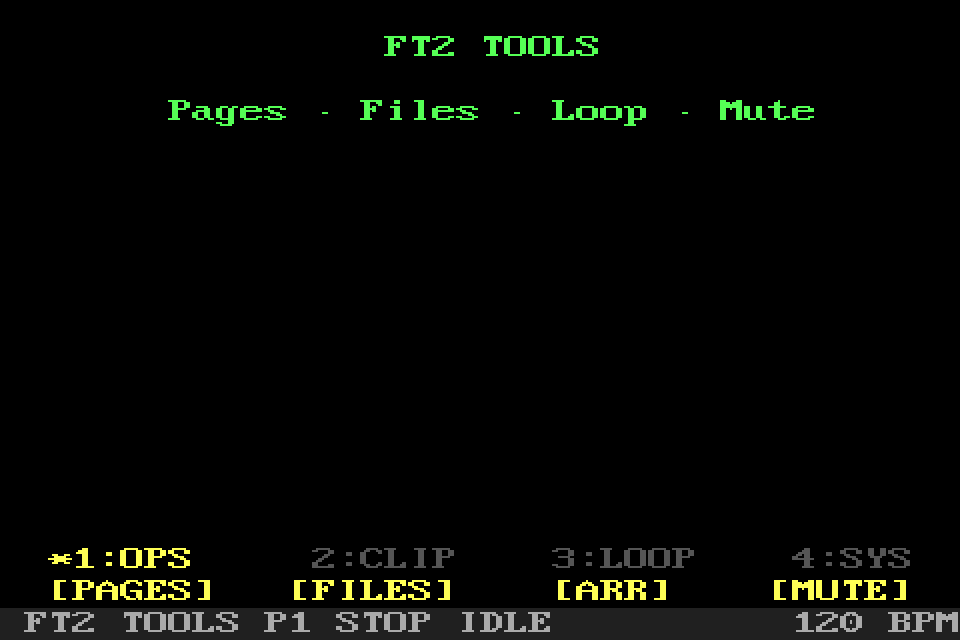

`TRACKS` opens pages, columns, and MIDI routing. `FILES` opens Project and
Pattern management. `ARRANGE` opens the Pattern order. `MUTE` toggles the
selected lane.

### CLIP — lane and page clipboard

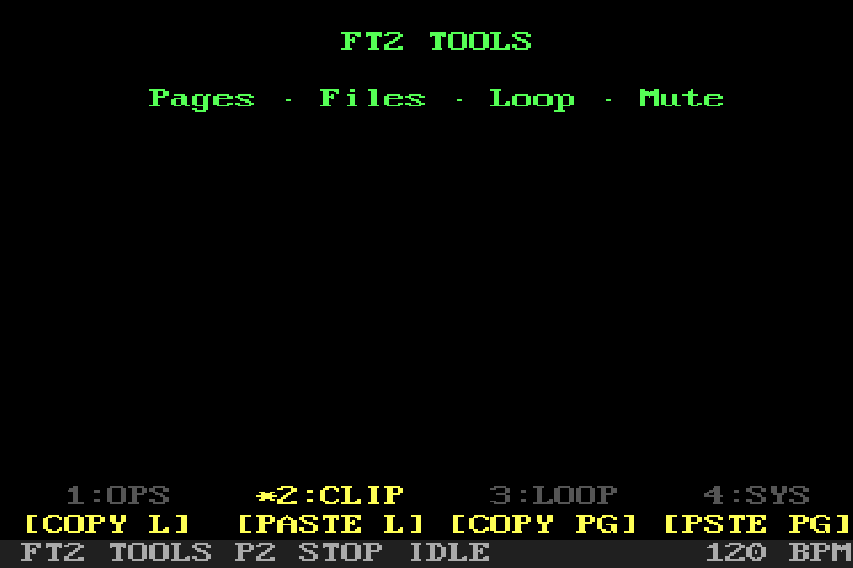

`CPY L`, `PST L`, `CPY P`, and `PST P` copy or paste the current lane or full
four-lane page. These are in-memory editing clipboards, not saved Projects.

### LOOP — attach or detach private audio

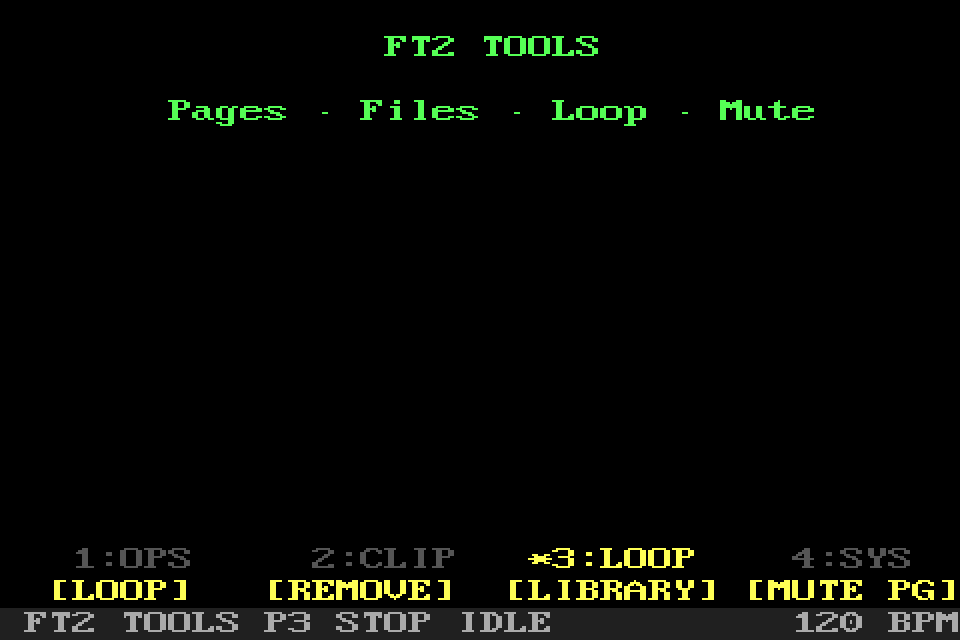

`LOOP` opens WAV-loop setup. `REMOVE` detaches the loop from this Project after
confirmation; it does not delete the private WAV file.

### SYS — safety, help, and return

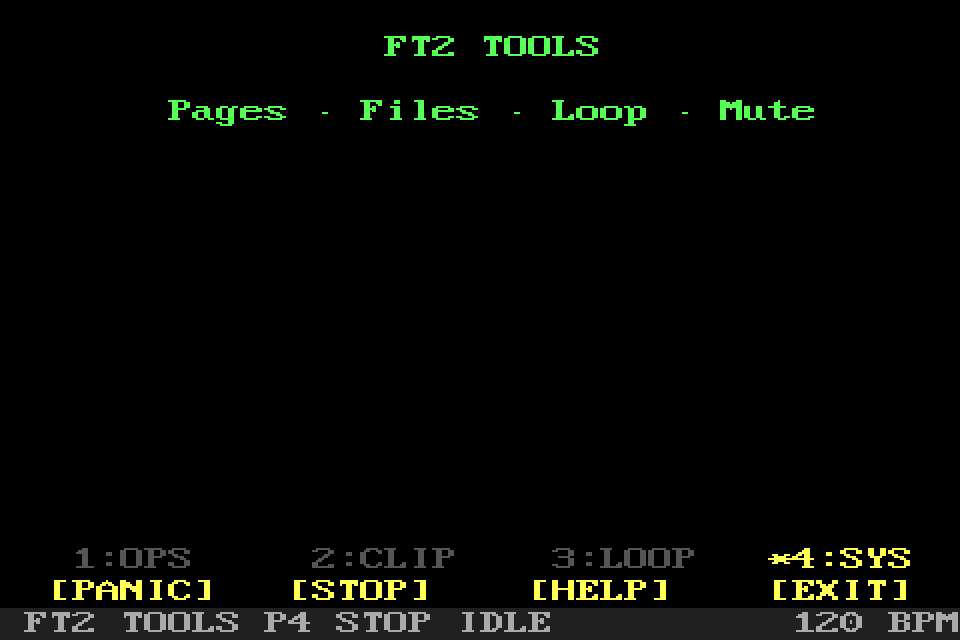

`PANIC`, `STOP`, and `HELP` retain their normal meanings. `EXIT` returns to the
Pattern editor.

## N00B setup

N00B mode maps incoming notes to the nearest pitch in one selected major or
natural-minor scale. Equal-distance ties map downward. Exact source-note
ownership is retained so every note-off releases the correct mapped note.

### OPS — choose a scale

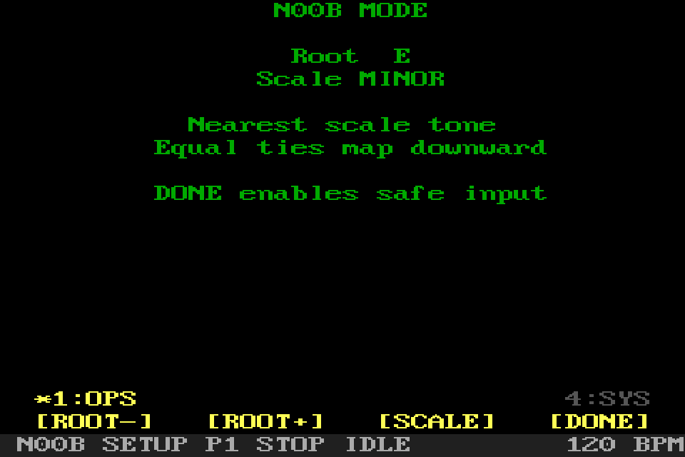

`ROOT-` and `ROOT+` choose the chromatic root. `SCALE` toggles major/natural
minor. `DONE` enables the selected mapping and returns to the Pattern.

### SYS — stop or cancel setup

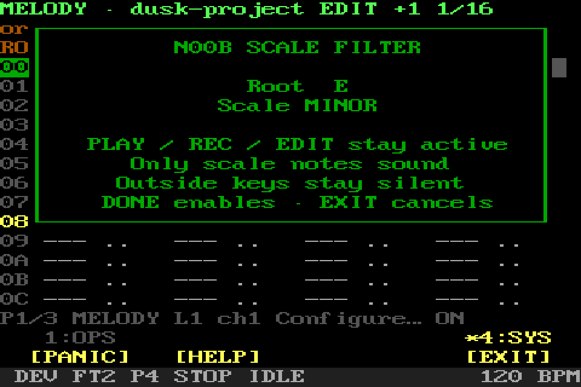

`PANIC`, `STOP`, and `HELP` remain available. `EXIT` returns without enabling
the draft selection.

## Project Files

Files manages complete saved Projects. Names shown to the musician are
editable. Save and Save As publish atomically and never silently replace a
collision. Preview uses the selected saved Project without treating it as the
current edit.

### OPS — load, save, preview, delete

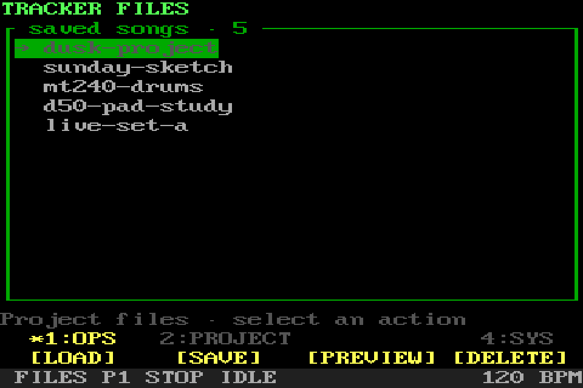

`LOAD` opens the selected Project. `SAVE` writes the current Project and asks
before replacement. `PREVIEW` starts or stops the selected Project preview.
`DELETE` requires repeat confirmation.

### PROJECT — lifecycle and Pattern child

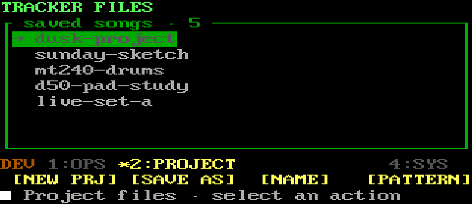

`NEW` creates a confirmed blank Project. `SAVE AS` writes a numbered
non-overwriting copy. `NAME` edits the Project display name. `PATTERN` opens
Pattern tools.

### SYS — stop and return

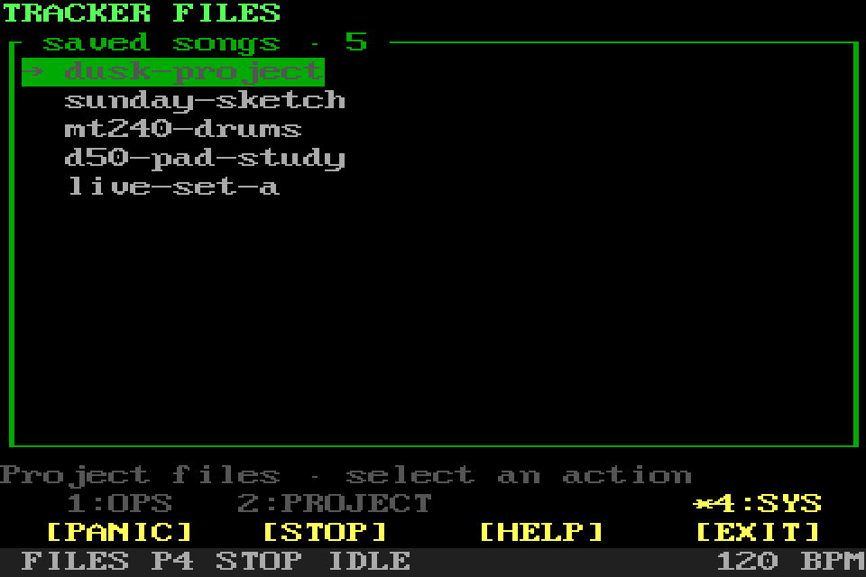

`PANIC`, `STOP`, and `HELP` remain available. `EXIT` cancels pending file
actions and returns to the tracker.

## Pattern tools

Pattern tools operate on the Pattern referenced by the current Arrangement
step. Cleanup deletes only zero-reference Patterns; it never rewrites the
Arrangement behind the user's back. Transposition affects melodic pages only.

### OPS — Pattern lifecycle

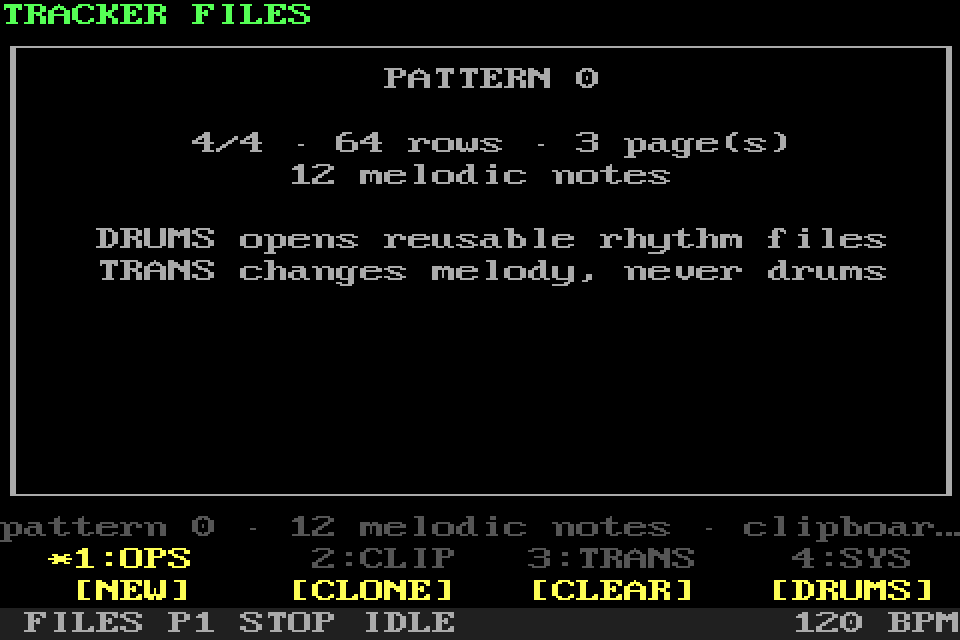

`NEW` opens Pattern setup. `CLONE` creates a separate copy and selects it.
`CLEAR` opens a confirmed clear/resize setup. `DRUMS` opens reusable rhythms.

### CLIP — Pattern clipboard and cleanup

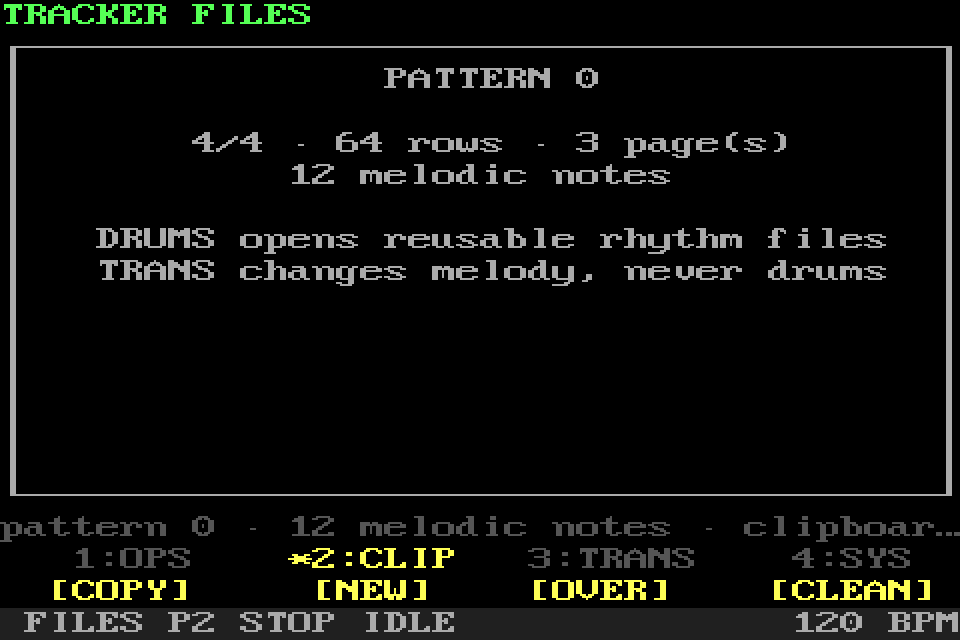

`COPY` stores the current Pattern in memory. `PASTE N` creates a new Pattern
from it. `PASTE O` asks before replacing the current Pattern. `CLEAN` deletes
only Patterns not referenced by any Arrangement step.

### TRANS — transpose melody only

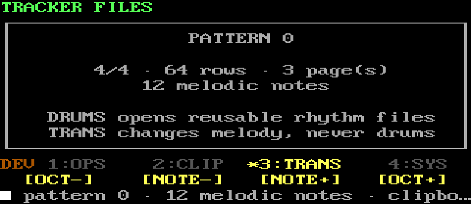

`OCT-`, `SEMI-`, `SEMI+`, and `OCT+` transpose melodic notes by −12, −1, +1,
or +12 semitones. Percussion pages and note-off commands are left unchanged.

### SYS — stop and return

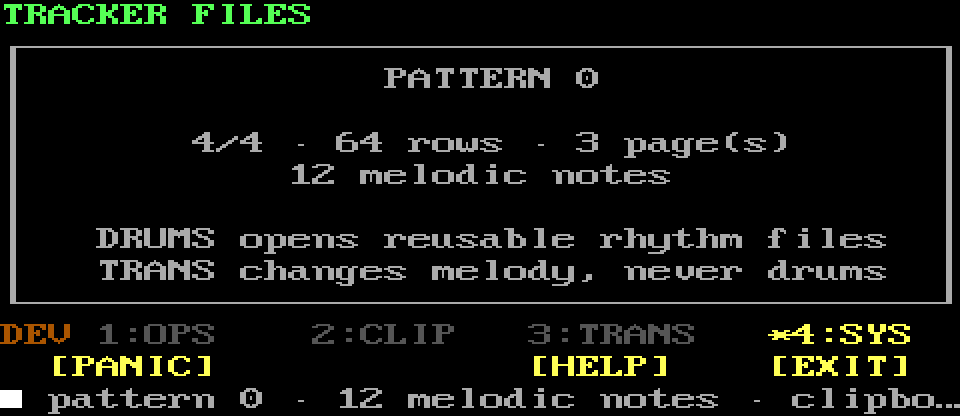

`PANIC`, `STOP`, and `HELP` stay available. `EXIT` returns to Project Files.

## Drum patterns

The library contains bundled read-only grooves plus user-saved four-lane drum
Patterns. Filters select genre, 3/4 or 4/4, and supported two-, four-, or
eight-bar row sizes. Loading may resize an empty melodic Pattern, but refuses a
shape change once melody exists.

### OPS — load and manage a rhythm

`LOAD` writes the selected rhythm into the percussion page without changing
its route. `SAVE` stores the current percussion page as a user rhythm.
`DELETE` can remove only a user save and requires confirmation.

### FILTER — narrow the library

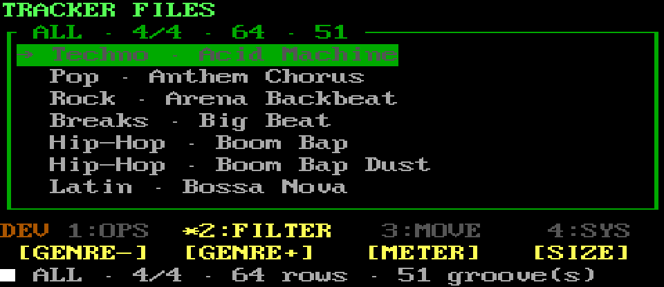

`GENRE-` and `GENRE+` move among the available genres and `ALL`. `METER`
toggles 3/4 and 4/4. `SIZE` cycles the supported Pattern lengths for that meter.

### MOVE — navigate a long result list

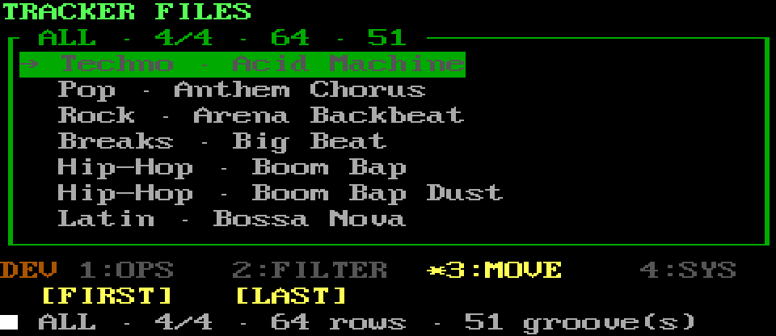

`PG UP`, `PG DOWN`, `FIRST`, and `LAST` move through the filtered result list
without loading anything.

### SYS — stop and return

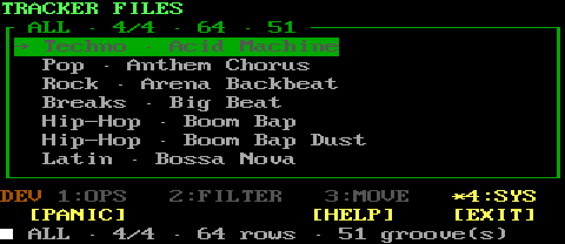

`PANIC`, `STOP`, and `HELP` remain available. `EXIT` returns to Pattern tools.

## Pattern setup

This confirmation context chooses musical meter and row count before a new or
destructively cleared Pattern is created. The supported sizes represent two,
four, eight, sixteen, or thirty-two bars in the selected meter.

### OPS — meter and size

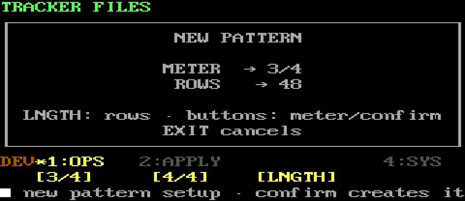

`3/4` and `4/4` choose the meter. `SIZE-` and `SIZE+` move among the matching
row counts. Turning the encoder also changes size.

### APPLY — confirm or preserve

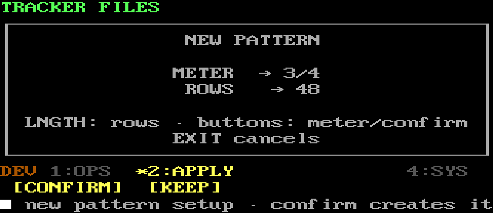

`CONFIRM` performs the new/clear operation with the displayed shape. `KEEP`
cancels the destructive reset and retains the current Pattern size.

### SYS — safety and cancellation

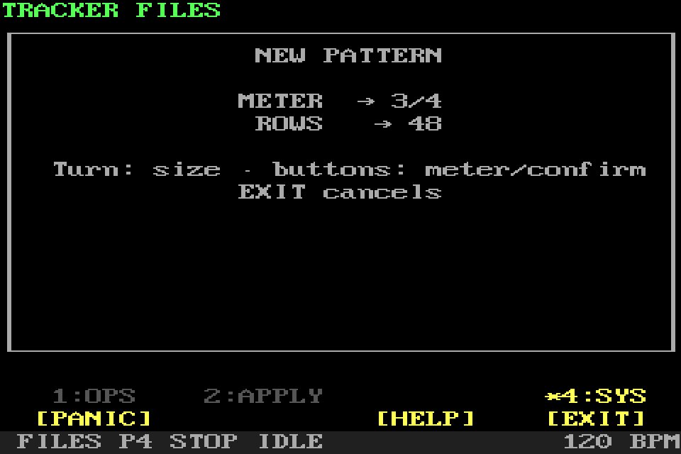

`PANIC` and `HELP` remain available. `EXIT` cancels the setup and returns to
Pattern tools.

## Arrangement

Arrangement is the ordered list of Pattern IDs that forms the Project
timeline. Repeated steps reference the same Pattern until it is cloned.

### OPS — play and insert Pattern references

`PLAY` starts at the selected step. `JUMP` opens that step's Pattern in the
editor. `APPEND` adds the current Pattern at the end. `INSERT` adds it before
the selected step.

### STEP — reorder and repeat

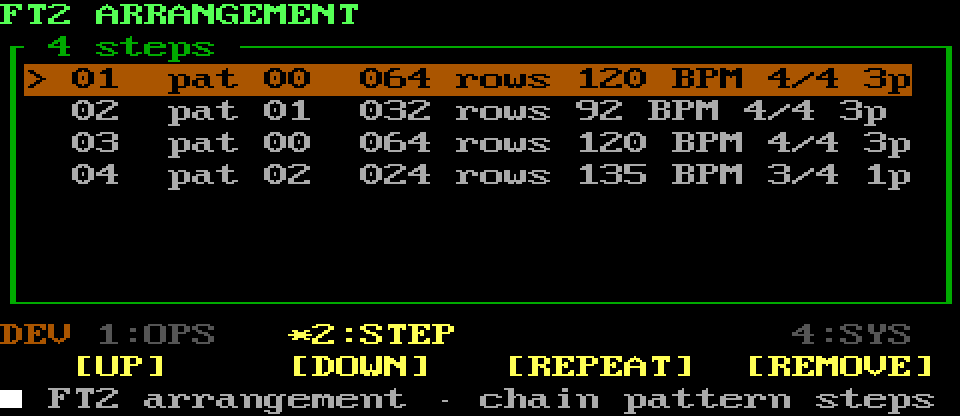

`UP` and `DOWN` move the selected step earlier or later. `REPEAT` duplicates
the reference. `REMOVE` removes only this step, not the underlying Pattern.

### SYS — stop and return

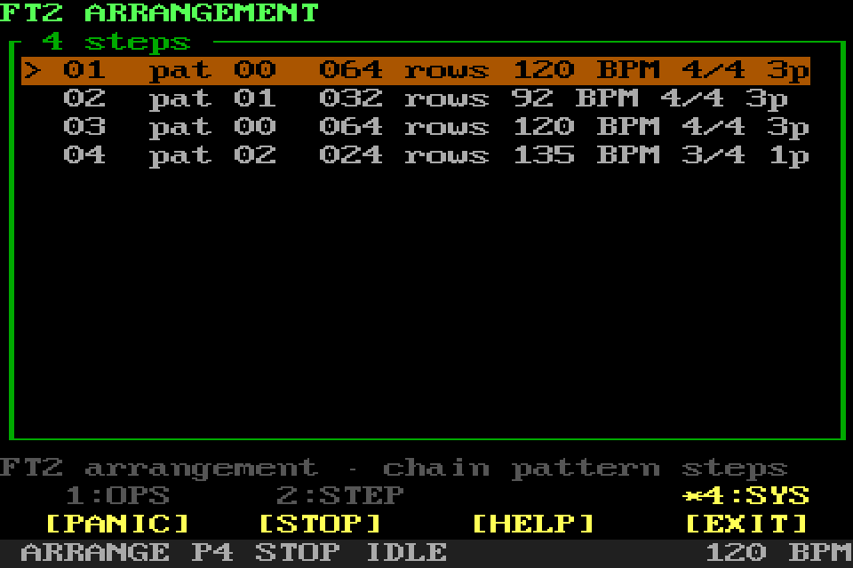

`PANIC`, `STOP`, and `HELP` remain available. `EXIT` returns to the tracker.

## Tracks and routing

The Tracks screen edits four-lane pages. Changes are kept as a draft until
`DONE`; `EXIT` restores the original Project. Turn the encoder to choose a page
in normal mode. A destination is shared by the page, while channel, bank, and
program belong to the selected column.

### OPS — add and route pages

`ADD` adds one four-lane page. `TARGET` opens the destination field. `CHANNEL`
opens the selected column's MIDI channel field. `DONE` validates conflicts and
keeps all page-manager changes.

### COLUMN — choose column and program

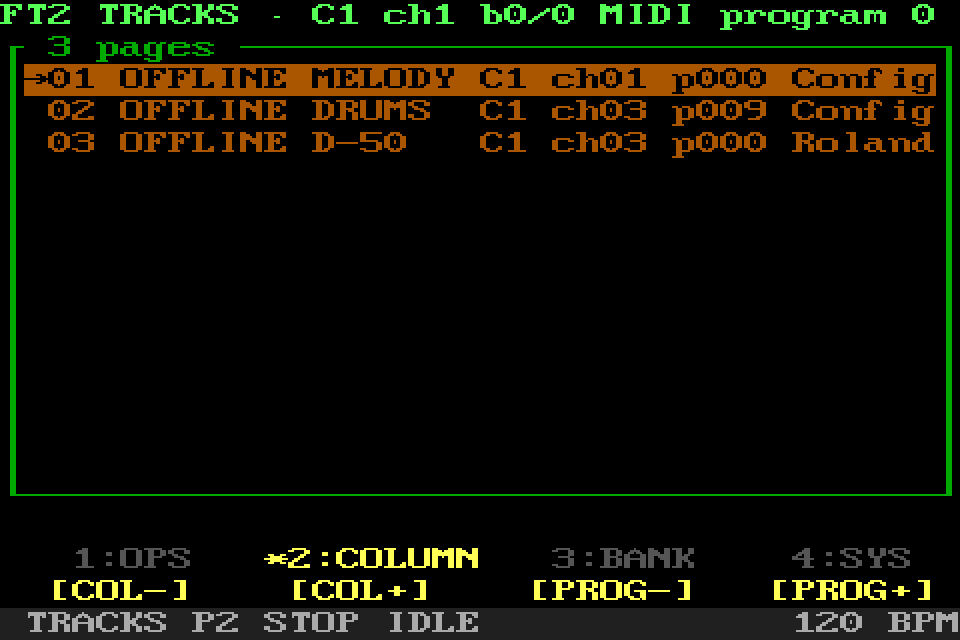

`COL-` and `COL+` select one of the page's four columns. `PROG-` and `PROG+`
choose its 0–127 program, using a device profile's name when available.

### BANK — choose the selected column's bank

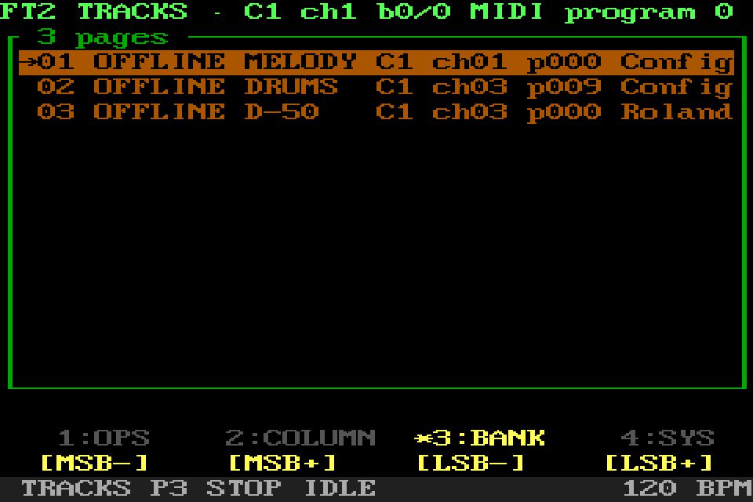

`MSB-`, `MSB+`, `LSB-`, and `LSB+` adjust the MIDI bank-select bytes for the
selected column. The configured bank-select order is honored during playback.

### SYS — mute, cancel, and safety

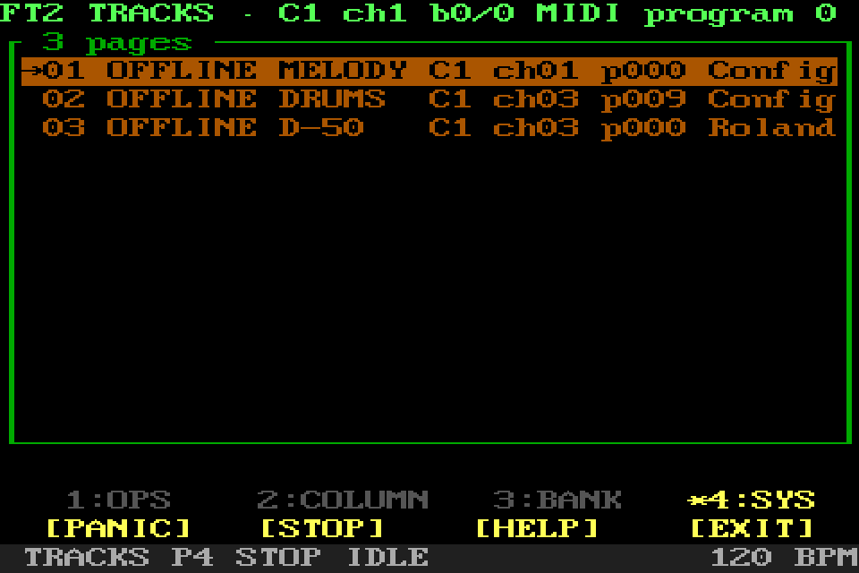

`PANIC` and `STOP` remain available. `MUTE` toggles the whole current page.
`EXIT` cancels the entire Tracks draft and restores the original Project.

## Target field editor

The target field lists the active software instrument, configured external
route, and discovered named MIDI outputs. Offline selections are retained in
the Project rather than silently rewritten.

### OPS — confirm destination

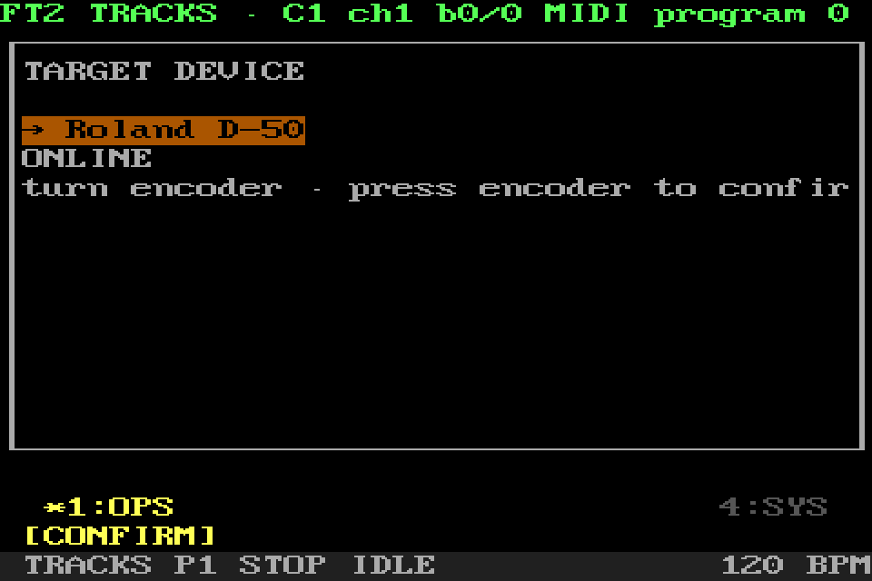

Turn the encoder to choose a device. `CONFIRM` applies the field to the draft
page and returns to Tracks. On eight- and five-button layouts, encoder press is
also confirm.

### SYS — cancel only this field

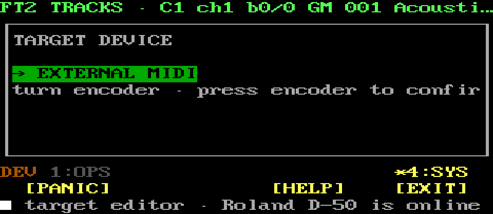

`PANIC`, `STOP`, and `HELP` stay available. `EXIT` cancels only the target
field and returns to the unchanged Tracks draft.

## Channel field editor

Channel editing affects only the selected column. The visible value is 1–16;
the persisted MIDI byte remains the standard zero-based 0–15 representation.

### OPS — confirm channel

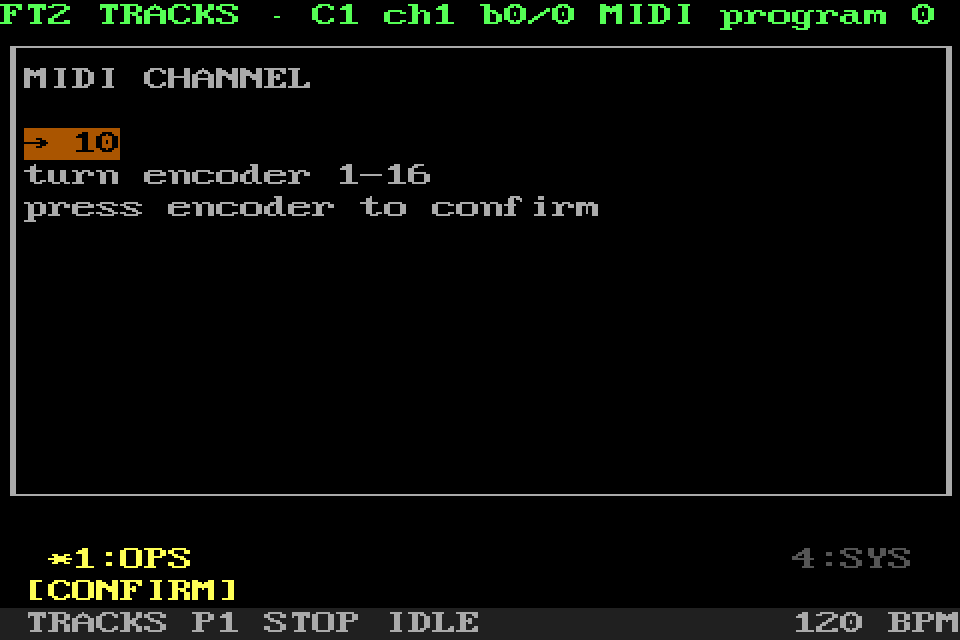

Turn the encoder to choose 1–16. `CONFIRM` applies the field and returns to
Tracks. Encoder press also confirms on eight- and five-button layouts.

### SYS — cancel only this field

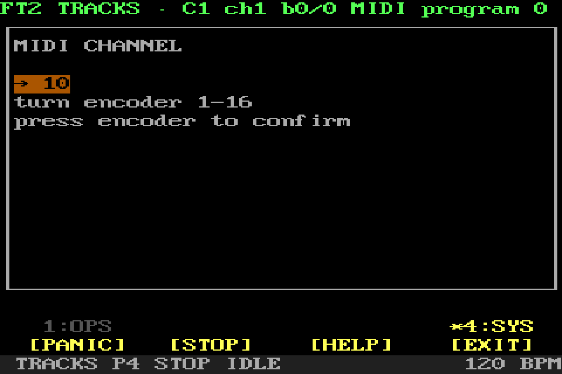

`PANIC`, `STOP`, and `HELP` stay available. `EXIT` discards only the channel
draft and returns to Tracks.
